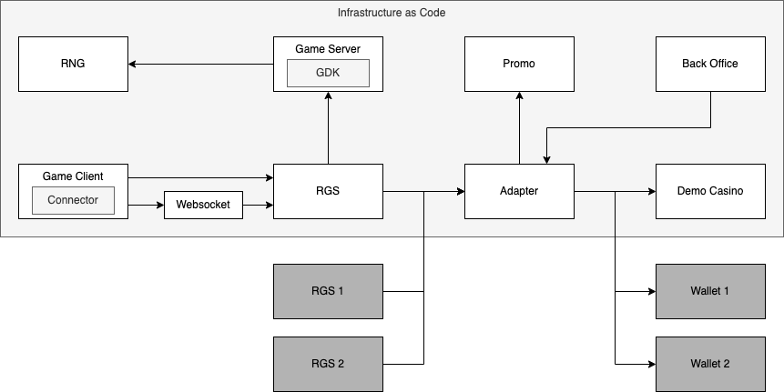

# Software Architecture

## Internal components

### Infrastructure as Code

Solution to set up and manage infrastructure used to operate the platform.

### GDK

A library to make casino game development easier by providing tools such as game simulation to extract game statistics such as RTP.

### Connector

Client library that includes funcionalities such as Reality Check, Game History, error handling, promo tools UI as well as it provides clean API interface for Game Clients towards the backend.

### Game Client

Visual presentation of the game.

### Websocket

Microservice that manages external websocket connections and distributes it to other microservices.

### RGS

Microservice that manages game related activities such as bet management, game processing, recovery, game history.

### Game Server

Game engines generating a game outcome and win amounts.

### RNG

Pseudo random number generator that outputs random numbers including real time validation and monitoring.

### Adapter

Microservice that manages transactions, reporting, wallet integrations and GraphQL endpoint.

### Promo

Microservice that manages campaigns such as Free Bets, Tournaments, Prize Drop and Jackpots.

### Back Office

Signle Page Application used to manage and control the platform.

### Demo Casino

Microservice used for PFF (Play For Fun) traffic for demo mode.

## External systems

### Wallet 1, 2, ...

External wallets of operators or aggregators.

### RGS 1, 2, ...

External RGS's where platform aggregates them