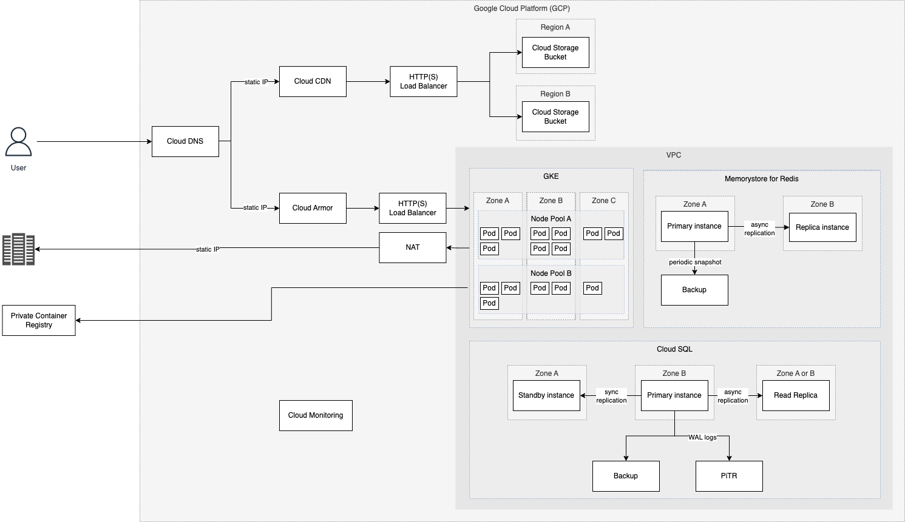

# Infrastructure Architecture

### CDN and static assets

Static files (such as game assets) are delivered via global CDN (Content Delivery Network) and multi-region Buckets with quite aggressive caching delivering great loading times for games.

### Cloud Armor

Cloud Armor takes care of DDoS protection and WAF (Web Application Firewall). Additionally, there is rate limiter configured and filter for some OWASP rules such as SQL injection.

### Kubernetes Cluster

To deploy and manage application we use GKE (Google Kubernetes Engine) which is managed solution for Kubernetes clusters.

High Availability is guaranteed by duplicating pods among three zones.

Scalability is delivered by (Horizontal Pod Autoscaling) which automatically increases/decreases number of pods of particular microservice based on CPU and memory configuration. If there is no space to create new pod within Node pool, new
one is automatically created.

### Database

For the database we use Cloud SQL for Postgres (version 12).

High Availability is guaranteed by keeping a Standby instance in a different zone with synchronous replication. In case of downtime In the event of an instance or zone failure, the standby instance becomes the new primary instance. Users
are then rerouted to the new primary instance. This process is called a failover. [Read More](https://cloud.google.com/sql/docs/postgres/high-availability).

There are automatic daily backup as well as [Point-in-time recovery](https://cloud.google.com/sql/docs/postgres/backup-recovery/pitr) with 7 days.

For most `select` queries (especially expensive reporting queries) we have Read Replica with asynchronous replication.

Automatic storage increase is enabled as well as Query Insight to be able to monitor expensive queries.

Scaling the database vertically (increase/decrease CPU or memory) is manual process which results in 5-10 minutes downtime.

### Redis

Memorystore for Redis is primarily used as an in-memory cache and asynchronous job scheduling.

Memorystore for Redis Cluster is based on open-source Redis version 7.x and supports a subset of the total Redis command library.

A highly availablilty is achieved with primary and replica being distributed across multiple zones to safeguard against a zonal outage.
Automatic failovers within an instance can occur due to maintenance or an unexpected failure of the primary node. During a failover a replica is promoted to be the primary. The service can also temporarily
provision extra replicas during internal maintenance to avoid any downtime.

In case of a catastrophic failure of instances we rely on automated backups and the ability to restore data from RDB snapshots that provide additional protection from data loss. With RDB snapshots enabled, if needed, a recovery is made from
the latest RDB snapshot.