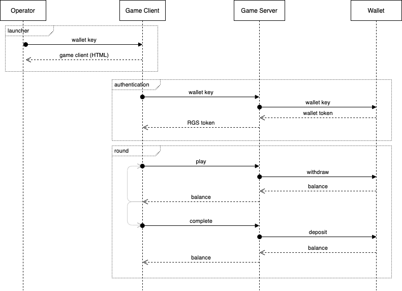
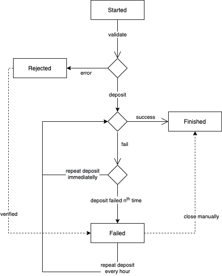
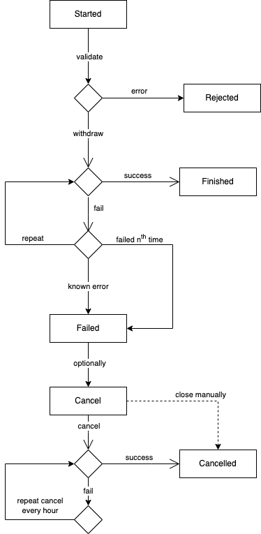

# Wallet Integration

## Introduction

This document describes integration between _Adapter_ and an _Wallet_ via _seamless API_.

The key words `MUST`, `MUST NOT`, `REQUIRED`, `SHALL`, `SHALL NOT`, `SHOULD`, `SHOULD NOT`, `RECOMMENDED`,  `MAY`, and `OPTIONAL` in this document are to be interpreted as described in [RFC 2119](https://www.ietf.org/rfc/rfc2119.txt).

## Set up information

_Wallet_ owner `SHOULD` provide:

- Endpoints for staging and production environments of the Wallet.
- _Wallet_ name.
- Minimum and maximum bet, maximum exposure (all values in `eur`).

_Wallet_ owner `SHOULD` be provided with:

- Endpoints for staging and production environments.
- `HMAC` secret keys for staging and production environments.
- IP of production environment to whitelist.

## Integration

Prerequisites:

- Communication `SHOULD` be done via `HTTP/1.1` and encrypted with `SSL/TLS`.
- All API requests `MUST` be passed with `Content-Type: application/json`.
- All API responses `MUST` be passed with `Content-Type: application/json`.
- Any additional response or request data, parameters, fields or codes not described in documentation `SHOULD NOT` be used.
- Character encoding utf-8 `SHOULD` be set to `UTF-8`
- All time and date fields `SHOULD` be in `UTC` timezone

### Authorization

Authorization `MUST` be done using the following headers:

- `Authorization`: _Player's_ authorization with `Bearer <token>` where `<token>` comes from `/authentication` request. It `MUST` be used to identify a _Player_.
- `X-Server-Authorization`: _Server's_ authorization with `HMAC` scheme using `sha256` algorithm and request payload as `hex` dump. Example of generating the hash: `echo -n $BODY | openssl dgst -sha256 -hmac $SECRET_KEY -hex`

The _Operator_ `MUST` check and validate headers and return error in case of incorrect authorization data.

### Response codes

All responses `MUST` return appropriate response's codes.

| Code  | Status            |
|-------|-------------------|
| `2XX` | Successful        |
| `4XX` | Application Error |
| `5XX` | Server Error      |

### Errors

All errors `MUST` follow unified structure.

```json
{
    "error": {
        "message": "Not enough money to make a withdrawal",
        "code": "INSUFFICIENT_FUNDS"
    }
}
```

Field `code` `SHOULD` contain one of the following codes:

| Code                    | Description                                                      |
|-------------------------|------------------------------------------------------------------|
| `PLAYER_UNAUTHORIZED`   | `Couldn't authorize the player (Authorization header missmatch)` |
| `SERVER_UNAUTHORIZED`   | `Couldn't authorize the server`                                  |
| `SESSION_EXPIRED`       | `Player's session expired`                                       |
| `INSUFFICIENT_FUNDS`    | `Not enough money to make withdrawal`                            |
| `TRANSACTION_NOT_FOUND` | `Transaction you are trying to cancel doesn't exist`             |
| `LOSS_LIMIT`            | `Loss limit has been exceeded`                                   |
| `TRANSACTION_FAILED`    | `Transaction was not processed`                                  |
| `BLOCKED_TERRITORY`     | `Blocked territory`                                              |
| `UNKNOWN`               | `Unknown error`                                                  |

Field `message` `SHOULD` contain reason of the error to help troubleshooting. It is not passed to the _Game Client_ on production environment, so it can be more descriptive.

### Idempotence

In case of error, network failure or other reasons selected requests `MAY` be repeated therefore selected requests `MUST` be [idempotent](https://restfulapi.net/idempotent-rest-apis/) and return the same outcome.

## Automated Wallet Verifier

Automated Wallet Verifier offers running automatic test to check integration correctness.

## Flow



### Deposit flow

In case of failure deposit transactions are repeated indefinitely for errors with a code `UNKNOWN` and network errors. First _n_ repeats `MAY` come right after the failure and then it still no success then it continues with some time
interval until it is
successful.



### Withdraw flow

For withdrawals, it `MAY` be repeated _n_ times right after the original transaction and if still didn't go through than cancel is initiated. Cancel is repeated with time interval until success.
Errors with a code `TRANSACTION_FAILED`, `INSUFFICIENT_FUNDS` and `LOSS_LIMIT` will not trigger cancels.
Cancels are repeated until balance is successfully returned or until error code `TRANSACTION_NOT_FOUND`.



## Launcher

To launch the game the _Operator_ should embed `<iframe>` pointing to `<URL>/launch/...` or use REST call to return data with url.

| Path                                  | Method          | Authorization | Description                       |
|:--------------------------------------|:----------------|:--------------|:----------------------------------|
| `/launch/{fun\|real}`                 | `GET` or `POST` | NO            | Redirects to HTML with the game   |
| `/wallet/{wallet}/launch/{fun\|real}` | `POST`          | YES           | Returns JSON data with launch url |

**Body or Query Parameters**

| Name         | Type     | Required                                                 | Example              | Description                                                                                                           |
|--------------|----------|----------------------------------------------------------|----------------------|-----------------------------------------------------------------------------------------------------------------------|
| `wallet`     | `string` | `REQUIRED`                                               | `myWallet`           | _Wallet_ Id.                                                                                                          |
| `operator`   | `string` | `REQUIRED`                                               | `myOperator`         | _Operator_ Id                                                                                                         |
| `game`       | `string` | `REQUIRED`                                               | `myGame`             | _Game_ Id                                                                                                             |
| `key`        | `string` | `OPTIONAL` in `fun` mode, <br/>`REQUIRED` in `real` mode | `dnsa89me329jdos`    | _Operator's_ session initialisation key which `SHOULD` be active only once after generation and expire after `4 hour` |
| `currency`   | `string` | `OPTIONAL`                                               | `eur`                | _Player's_ currency (lowercase)                                                                                       |
| `language`   | `string` | `OPTIONAL`                                               | `en`                 | _Player's_ language code in [ISO 639-1](https://www.loc.gov/standards/iso639-2/php/code_list.php) format              |
| `depositUrl` | `string` | `OPTIONAL`                                               | `http://deposit.url` | URL to _Operator's_ in-game deposit web page                                                                          |
| `refreshUrl` | `string` | `OPTIONAL`                                               | `http://refresh.url` | URL used after refreshing the game                                                                                    |
| `lobbyUrl`   | `string` | `OPTIONAL`                                               | `http://lobby.url`   | URL to _Operator's_ lobby                                                                                             |
| `exitTarget` | `string` | `OPTIONAL`                                               | `self` or `parent`   | If `self` than `lobbyUrl` will be used on `window`, otherwise it will redirect `window.parent`                        |
| `theme`      | `string` | `OPTIONAL`                                               | `myTheme`            | Additional parameter expected by some games to change its theme                                                       |

**Response**

Returns HTML web page containing the game or `{"url": "http://example.com/launch"}`

---

To launch the game's replay (round summary) the _Operator_ should embed `<iframe>` pointing to `<URL>/launch/replay` or use REST call to return data with url.

| Path                             | Method          | Authorization | Description                       |
|:---------------------------------|:----------------|:--------------|:----------------------------------|
| `/launch/{fun\|real}`            | `GET` or `POST` | NO            | Redirects to HTML with the game   |
| `/wallet/{wallet}/launch/replay` | `POST`          | YES           | Returns JSON data with replay url |

**Body or Query Parameters**

| Name      | Type     | Required   | Example                                | Description                                        |
|-----------|----------|------------|----------------------------------------|----------------------------------------------------|
| `game`    | `string` | `REQUIRED` | `myGame`                               | _Game_ Id                                          |
| `roundId` | `string` | `OPTIONAL` | `123e4567-e89b-12d3-a456-426614174000` | Round Id, one round can have multiple transactions |

**Response**

Returns HTML web page containing the game or `{"url": "https://example.com/replay"}`

## API

**Path**:`/authenticate`
**Method**:`POST`
**Authorization**:`X-Server-Authorization`
**Idempotent**:`NO`

Authenticates a _Player_ and starts a new session.

**Body**

| Name       | Type     | Required   | Example           | Description                                                                                                      |
|------------|----------|------------|-------------------|------------------------------------------------------------------------------------------------------------------|
| `operator` | `string` | `REQUIRED` | `MyOperator`      | _Operator_ Id                                                                                                    |
| `key`      | `string` | `REQUIRED` | `dnsa89me329jdos` | _Wallet's_ session initialisation key which `SHOULD` be active only one time after generation                    |
| `wallet`   | `string` | `OPTIONAL` | `MyWallet`        | _Wallet's_ name                                                                                                  |
| `provider` | `string` | `OPTIONAL` | `MyProvider`      | _Provider's_ name                                                                                                |
| `game`     | `string` | `OPTIONAL` | `MyGame`          | _Game's_ name                                                                                                    |
| `ip`       | `string` | `OPTIONAL` | `123.45.67.89`    | _Player's_ IP                                                                                                    |
| `channel`  | `string` | `OPTIONAL` | `desktop`         | _Player's_ device (`desktop`, `mobile`). It is not available in case of automated transactions like autocomplete |

**Response**

| Name            | Type          |            | Example                      | Description                                                                                                                                                                                                                                    |
|-----------------|---------------|------------|------------------------------|------------------------------------------------------------------------------------------------------------------------------------------------------------------------------------------------------------------------------------------------|
| `nativeId`      | `string`      | `REQUIRED` | `user123432`                 | _Wallet's_ Player Id. `MUST` be unique across entire all operators and brands                                                                                                                                                                  |
| `token`         | `string`      | `REQUIRED` | `db76b22745bca2cd`           | Authorization token which will be sent in `Authorization` header in order to verify _Player_                                                                                                                                                   |
| `balance`       | `number`      | `REQUIRED` | `100.85`                     | _Player's_ current balance in _player's_ currency                                                                                                                                                                                              |
| `currency`      | `string`      | `REQUIRED` | `eur`                        | _Player's_ currency (lowercase), ***`MUST NOT` change once set!***                                                                                                                                                                             |
| `brand`         | `string`      | `REQUIRED` | `YellowCasino`               | _Operator's_ brand                                                                                                                                                                                                                             |
| `nickname`      | `string`      | `OPTIONAL` | `JohnyBravo`                 | _Player's_ nickname                                                                                                                                                                                                                            |
| `gender`        | `string`      | `OPTIONAL` | `m`                          | _Player's_ gender (`m` or `f`)                                                                                                                                                                                                                 |
| `country`       | `string`      | `OPTIONAL` | `uk`                         | _Player's_ country code in [ISO 3166-1 Alpha-2](https://www.iban.com/country-codes) format but lowercase                                                                                                                                       |
| `jurisdiction`  | `string`      | `OPTIONAL` | `mt`                         | _Player's_ jurisdiction in case of specific market requirements i.e. `mt`, `uk`, `dk`                                                                                                                                                          |
| `sessionData`   | `SessionData` | `OPTIONAL` | `{betConfig: {maxBet: 100}}` | Typically provides extra data or overwrites system configuration. Applied only to current session.  [See SessionData](#sessiondata)                                                                                                            |
| `campaignTypes` | `string[]`    | `OPTIONAL` | `["freeBets"]`               | Promo tools available for given player. <br/>If not specified it will apply all tools, <br/>if `[]` it will apply none,<br/>otherwise it will apply only specified tools.<br/><br/>Available tools are: `freeBets`, `tournament`, `prizeDrop`. |

---

**Path**:`/balance`
**Method**:`POST`
**Authorization**:`X-Server-Authorization` and `Authorization`
**Idempotent**:`YES`

Fetches _Player's_ current balance in _Player's_ currency.

**Body**

| Name       | Type     |            | Example         | Description           |
|------------|----------|------------|-----------------|-----------------------|
| `nativeId` | `string` | `REQUIRED` | `user123432`    | _Wallet's_ Player Id  |
| `playerId` | `string` | `OPTIONAL` | `user123432`    | _Adapter's_ Player Id |
| `game`     | `string` | `REQUIRED` | `superSlot`     | Name of the game      |
| `provider` | `string` | `REQUIRED` | `superProvider` | _Provider's_ name     |

**Response**

| Name      | Type     |            | Example  | Description                                       |
|-----------|----------|------------|----------|---------------------------------------------------|
| `balance` | `number` | `REQUIRED` | `100.85` | _Player's_ current balance in _player's_ currency |

---

**Path**:`/transaction`
**Method**:`PUT` (recommended) or `POST`
**Authorization**:`X-Server-Authorization` and `Authorization`
**Idempotent**:`YES`

Withdraws from or deposits money to _Player's_ account. If transaction with given `transactionId` was already processed then don't modify the account and return current balance.

**Body**

| Name            | Type          |            | Example                                                                                       | Description                                                                                                                                                                           |
|-----------------|---------------|------------|-----------------------------------------------------------------------------------------------|---------------------------------------------------------------------------------------------------------------------------------------------------------------------------------------|
| `nativeId`      | `string`      | `REQUIRED` | `user123432`                                                                                  | _Wallet's_ Player Id                                                                                                                                                                  |
| `playerId`      | `string`      | `OPTIONAL` | `user123432`                                                                                  | _Adapter's_ Player Id                                                                                                                                                                 |
| `transactionId` | `string`      | `REQUIRED` | `321e4567-e89b-45d3-b594-41234174249`                                                         | Transaction Id                                                                                                                                                                        |
| `type`          | `string`      | `REQUIRED` | `withdraw`                                                                                    | `withdraw` reduces _Player's_ balance.<br/>`deposit` increases _Player's_ balance.                                                                                                    |
| `provider`      | `string`      | `OPTIONAL` | `superProvider`                                                                               | _Provider's_ name - field can be undefined when transaction doesn't relate to any game (e.g. tournament promo payout, tip)                                                            |
| `amount`        | `number`      | `REQUIRED` | `10.56`                                                                                       | Amount in _Player's_ currency to withdraw from the account. Withdrawal of 0 (zero) amount `MUST` be supported.                                                                        |
| `jackpotAmount` | `number`      | `OPTIONAL` | `0.001745`                                                                                    | Part of `amount` which goes to jackpot contribution (in case of withdrawals) or jackpot win (in case of deposits). Please note contribution can have more then usual 2-decimal places |
| `game`          | `string`      | `OPTIONAL` | `superSlot`                                                                                   | Name of the game field can be undefined when transaction doesn't relate to any game (e.g. tournament promo payout, tip)                                                               |
| `roundId`       | `string`      | `OPTIONAL` | `123e4567-e89b-12d3-a456-426614174000`                                                        | Round Id, one round can have multiple transactions                                                                                                                                    |
| `roundFinished` | `boolean`     | `OPTIONAL` | `true`                                                                                        | Indicates whether round has finished. No further transactions with the same `roundId` should be accepted once the round is finished                                                   |
| `category`      | `string`      | `OPTIONAL` | `promo`                                                                                       | Category of transaction: `normal`, `side`, `tip`, `promo`, `jackpot`                                                                                                                  |
| `name`          | `string`      | `OPTIONAL` | `Royal Match`                                                                                 | Name of the transaction                                                                                                                                                               |
| `campaignType`  | `string`      | `OPTIONAL` | `freeBets`                                                                                    | Type of promotional tool `freeBets`, `tournament`, `prizeDrop` (can be more)                                                                                                          |
| `campaignId`    | `string`      | `OPTIONAL` | `myCampaign123`                                                                               | Id of promotional campaign                                                                                                                                                            |
| `campaignData`  | `object`      | `OPTIONAL` | `{ total: 10, used: 2, amount: 1, totalWin: 17.4 }`                                           | Additional data for the promotional campaign                                                                                                                                          |
| `regulatory`    | `IRegulatory` | `OPTIONAL` | `{ pt: { "sm_result": "0:1;3;1;1;1#5;0;7;2;1#5;0;5;2;2#", "descr_ap": "60GoldenCoinsPro" } }` | Regulatory information present only in deposit transactions, currently includes Portuguese regulatory information [See IRegulatory](#iregulatory)                                     |
| `ip`            | `string`      | `OPTIONAL` | `123.45.67.89`                                                                                | _Player's_ IP                                                                                                                                                                         |
| `currency`      | `string`      | `REQUIRED` | `eur`                                                                                         | _Player's_ currency                                                                                                                                                                   |

**Response**

| Name      | Type     |            | Example  | Description                |
|-----------|----------|------------|----------|----------------------------|
| `balance` | `number` | `REQUIRED` | `100.85` | _Player's_ current balance |

---

**Path**:`/cancel`
**Method**:`DELETE` (recommended) or `POST`
**Authorization**:`X-Server-Authorization` and `Authorization`
**Idempotent**:`YES`

Returns once withdrew money to an original account (deposits `MUST NOT` be cancelled).
If transaction with given `transactionId` was already cancelled then don't modify the account and return current balance.
If transaction with given `transactionId` doesn't exist in your system return current balance like if it was successfully cancelled.
It `MUST NOT` be possible to create new transactions with `transactionId` which was once cancelled.

Please note it should cancel a transaction, not a round.

**Body**

| Name            | Type     |            | Example                               | Description           |
|-----------------|----------|------------|---------------------------------------|-----------------------|
| `nativeId`      | `string` | `REQUIRED` | `user123432`                          | _Wallet's_ Player Id  |
| `playerId`      | `string` | `OPTIONAL` | `user123432`                          | _Adapter's_ Player Id |
| `transactionId` | `string` | `REQUIRED` | `321e4567-e89b-45d3-b594-41234174249` | Transaction Id        |
| `roundId`       | `string` | `REQUIRED` | `321e4567-e89b-45d3-b594-41234174249` | Round Id              |

**Response**

| Name      | Type     |            | Example  | Description                |
|-----------|----------|------------|----------|----------------------------|
| `balance` | `number` | `REQUIRED` | `100.85` | _Player's_ current balance |

---

### SessionData

| Name                    | Type     |            | Example                                | Description                                                                                                                                  |
|-------------------------|----------|------------|----------------------------------------|----------------------------------------------------------------------------------------------------------------------------------------------|
| `italy.sessionId`       | `string` | `OPTIONAL` | `db76b227-0582-45bc-a2cd-fbf38449f28e` | Session Id (for Italy regulation)                                                                                                            |
| `italy.ticketid`        | `string` | `OPTIONAL` | `db76b227-0582-45bc-a2cd-fbf38449f28e` | Ticket Id (for Italy regulation)                                                                                                             |
| `betConfig.minBet`      | `number` | `OPTIONAL` | `0.5`                                  | Min bet in player's currency                                                                                                                 |
| `betConfig.maxBet`      | `number` | `OPTIONAL` | `100`                                  | Max bet in player's currency                                                                                                                 |
| `betConfig.maxBonusBet` | `number` | `OPTIONAL` | `1000`                                 | Max bet in player's currency (for non-main bets i.e. buy bonus). If not specified then maxBet will be applied to all bets including non-main |
| `betConfig.maxExposure` | `number` | `OPTIONAL` | `1000000`                              | Max exposure in player's currency                                                                                                            |
| `betConfig.defaultBet`  | `number` | `OPTIONAL` | `2`                                    | Default bet in player's currency                                                                                                             |
| `settings.lobbyUrl`     | `string` | `OPTIONAL` | `http://example.com`                   | Alternative to passing it via launch URL                                                                                                     |
| `settings.historyUrl`   | `string` | `OPTIONAL` | `http://example.com`                   | Alternative to passing it via launch URL                                                                                                     |
| `settings.depositUrl`   | `string` | `OPTIONAL` | `http://example.com`                   | Alternative to passing it via launch URL                                                                                                     |
| `currencyRate`          | `number` | `OPTIONAL` | `10`                                   | Overwrites conversion rate specified by our system                                                                                           |

---

### IRegulatory

| Name              | Type                    |            | Example                            | Description                                      |
|-------------------|-------------------------|------------|------------------------------------|--------------------------------------------------|
| `pt["sm_result"]` | `string`                | `OPTIONAL` | `0:1;3;1;1;1#5;0;7;2;1#5;0;5;2;2#` | sm_result AJOG file entry                        |
| `pt["descr_ap"]`  | `string`                | `OPTIONAL` | `60GoldenCoinsPro`                 | descr_ap AJOG file entry                         |
| `pt`              | `[key: string]: string` | `OPTIONAL` |                                    | Dictionary with other optional AJOG file entries |

## Extra API

The platform exposes set of additional endpoints. In this case, it's the _Wallet_ who performs HTTP POST calls to the Platform.
All requests `MUST` be authorized with the `secretKey` symmetrically to how the Platform secures it's requests (see [Authorization](#authorization)).

### Add Free Bets

**Path**:`/wallet/${wallet}/freeBets/add`  
**Method**:`POST`  
**Authorization**:`X-Server-Authorization`  
**Idempotent**:`NO`

Assigns a number of free bets to one or multiple Players for one or multiple games.

**Body**

| Name               | Type       | Required   | Example                     | Description                                                        |
|--------------------|------------|------------|-----------------------------|--------------------------------------------------------------------|
| `walletCampaignId` | `string`   | `REQUIRED` | `wallet-campaign-2025`      | Wallet's identifier of the Free Bets campaign within the _Wallet_. |
| `games`            | `string[]` | `REQUIRED` | `["superSlot", "megaSpin"]` | List of game identifiers to which free bets apply.                 |
| `nativeIds`        | `string[]` | `REQUIRED` | `["user123", "user456"]`    | List of _Wallet's_ Player Ids to receive the free bets.            |
| `start`            | `integer`  | `OPTIONAL` | `1730400000`                | Start time of campaign in **Unix timestamp (milliseconds)**.       |
| `end`              | `integer`  | `OPTIONAL` | `1733000000`                | End time of campaign in **Unix timestamp (milliseconds)**.         |
| `bets`             | `integer`  | `REQUIRED` | `10`                        | Number of free bets granted to each player.                        |
| `amount`           | `number`   | `REQUIRED` | `1.00`                      | Amount per single free bet in player's currency.                   |
| `currency`         | `string`   | `REQUIRED` | `eur`                       | Currency code (lowercase).                                         |
| `operator`         | `string`   | `REQUIRED` | `my-operator`               | Players' operator.                                                 |
| `brand`            | `string`   | `REQUIRED` | `my-brand`                  | Players' brand.                                                    |

**Response**

Returns confirmation object from RGS Adapter indicating successful creation.

```json
{
    "success": true
}
```

### Remove Free Bets

**Path**:`/wallet/${wallet}/freeBets/remove`  
**Method**:`POST`  
**Authorization**:`X-Server-Authorization`  
**Idempotent**:`NO`

Removes or deactivates Free Bets campaign for given walletCampaignId.

**Body**

| Name               | Type       | Required   | Example                     | Description                                                                              |
|--------------------|------------|------------|-----------------------------|------------------------------------------------------------------------------------------|
| `walletCampaignId` | `string`   | `REQUIRED` | `fb-campaign-2025`          | Wallet's identifier of the Free Bets campaign to remove.                                 |
| `games`            | `string[]` | `REQUIRED` | `["superSlot", "megaSpin"]` | List of games that the campaign was added for (required to locate the campaign in Rgss). |

| `operator`   | `string`   | `REQUIRED` | `my-operator`               | Players' operator. |
| `brand`            | `string`   | `REQUIRED` | `my-brand`                  | Players' brand. |

**Response**

```json
{
    "success": true
}
```

### Available Bets

**Path**:`/wallet/${wallet}/freeBets/availableBets`  
**Method**:`POST`  
**Authorization**:`X-Server-Authorization`  
**Idempotent**:`NO`

Retrieves available Free Bets for given games and currencies.

**Body**

| Name         | Type       | Required   | Example                     | Description                         |
|--------------|------------|------------|-----------------------------|-------------------------------------|
| `games`      | `string[]` | `REQUIRED` | `["superSlot", "megaSpin"]` | List of game identifiers.           |
| `currencies` | `string[]` | `REQUIRED` | `["eur""]`                  | List of currency codes (lowercase). |
| `operator`   | `string`   | `REQUIRED` | `my-operator`               | Players' operator.                  |
| `brand`      | `string`   | `REQUIRED` | `my-brand`                  | Players' brand.                     |

**Response**

```json
{
    "superSlot": {
        "eur": [
            0.1,
            1,
            10
        ]
    },
    "megaSpin": {
        "eur": [
            0.2,
            2,
            20
        ]
    }
}
```

### Available Games

**Path**:`/wallet/${wallet}/availableGames`  
**Method**:`POST`  
**Authorization**:`X-Server-Authorization`  
**Idempotent**:`NO`

Retrieves list of available games.

**Body**

| Name       | Type     | Required   | Example       | Description        |
|------------|----------|------------|---------------|--------------------|
| `operator` | `string` | `OPTIONAL` | `myOperator`  | Operator's id.     |
| `brand`    | `string` | `OPTIONAL` | `myBrand`     | Brand's id.        |

**Response**

```json
[
    {
        "provider": "myProvider",
        "game": "superSlot",
        "type": "slot",
        "title": "My super slot"
    },
    {
        "provider": "myProvider",
        "game": "anotherSlot",
        "type": "slot",
        "title": "My another super slot"
    }
]
```
