# Backoffice Manual

<!-- BEGIN_CUSTOMER_SERVICE -->

## Customer Service <!-- id="customer-service" -->

### Overview

The **Customer Service** (CS) module lets support agents inspect player activity, process refunds and force‑close sessions. Access is usually limited to **CS Agents**, **Risk Analysts** and select **Finance** staff.

| Sub‑section      | Typical Role Example | Purpose                                                               |
| ---------------- | -------------------- | --------------------------------------------------------------------- |
| **Transactions** | CS Agent, Finance    | Drill‑down into single transactions, refund or adjust where permitted |
| **Players**      | CS Agent             | View a player’s profile, self‑exclusions and notes                    |
| **Sessions**     | CS Agent, Risk       | Monitor active or historical sessions and terminate if needed         |

#### Transactions <!-- id="transactions" -->

**Screenshots**  
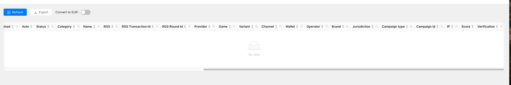  
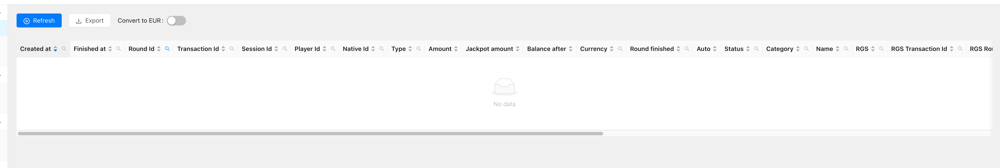

_Grid columns_  
`Created at`, `Finished at`, `Round Id`, `Transaction Id`, `Session Id`, `Player Id`, `Native Id`, `Type`, `Amount`, `Jackpot amount`, `Balance after`, `Currency`, `Round finished`, `Auto`, `Status`, `Category`, `Name`, `RGS`, `RGS Transaction Id`, `RGS Round Id`, `Provider`, `Game`, `Variant`, `Channel`, `Wallet`, `Operator`, `Brand`, `Jurisdiction`, `Campaign type`, `Campaign Id`, `IP`, `Score`, `Verification`.

| Control            | Description                                                          |
| ------------------ | -------------------------------------------------------------------- |
| **Refresh**        | Reloads the list with current data (keeps filters).                  |
| **Export**         | Downloads the visible data as CSV.                                   |
| **Convert to EUR** | If ON, monetary columns convert to EUR using the latest fixed rates. |

**Typical workflow**

1. Narrow the date range with the calendar widget.
2. Use column search (🔍) to locate a **Player Id** or **Transaction Id**.
3. Click a roundId to open details for respective round and related transactions.
4. **Export** the filtered list for reconciliation or BI processing.

##### Round-detail drawer <!-- id="transactions-round-detail" -->

Clicking any roundId in **Transactions** opens a side drawer with five stacked blocks that let agents audit a single game round end-to-end:

| Block                  | What you’ll see                                                                                                                                                                                                                                                   | Why it matters                                                                                                                                  |
| ---------------------- | ----------------------------------------------------------------------------------------------------------------------------------------------------------------------------------------------------------------------------------------------------------------- | ----------------------------------------------------------------------------------------------------------------------------------------------- |
| **Interactive replay** | A mini canvas that re-plays the round step-by-step. A header strip shows **Bet**, **Multiplier** and **Payout** values.                                                                                                                                           | Lets CS agents visually confirm the player’s outcome without launching the game client.                                                         |
| **Wagers**             | A per-action log: `Date`, `Bet`, `Win`, `Action`, `Next`, `Params`, `State`, `Data`, `Auto`.                                                                                                                                                                      | Shows every hit/stand/double (etc.) decision with its exact stake and outcome.                                                                  |
| **Round**              | High-level metadata: `CreatedAt`, `Status` (`finished`, `cancelled`, …).                                                                                                                                                                                          | Confirms the round lifecycle—useful when players claim the round never settled.                                                                 |
| **Transactions**       | The wallet ledger slice for this round: `Created at`, `Finished at`, `Cancelled at`, `Transaction Id`, `Type` (`deposit` / `withdraw`), `Amount`, `Currency`, `Campaign Type/Id`, `RGS Transaction Id`, `Auto`, `Channel`, `IP`, plus a `Round finished` boolean. | Lets you trace every balance movement that the round triggered.                                                                                 |
| **Summary**            | A single column table:<br/>`Round Id`, `Player Id`, `Native Id`, `RGS`, `RGS Round Id`, `Provider`, `Game`, `Variant`, `Currency`, `Wallet`, `Operator`, `Brand`, `Jurisdiction`, `Win ratio`, and a blue **Replay URL** hyperlink.                               | Pocket-size reference that can be copied into a ticket; the **Replay URL** opens the same interactive replay in a new tab for external sharing. |

> **Tip:** Agents can copy the **Replay URL** into emails or chat to show players view of the round without giving them back-office access.

> **Auto** shows **Yes** when the system auto-settled the transaction (e.g., lost bet). Manual corrections display **No**.

#### Sessions <!-- id="sessions" -->

**Screenshot**  
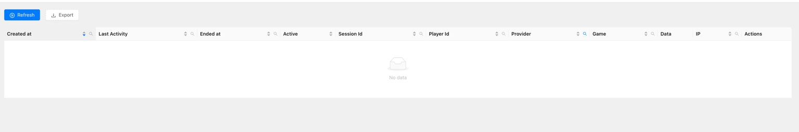

_Grid columns_  
`Created at`, `Last Activity`, `Ended at`, `Active`, `Session Id`, `Player Id`, `Provider`, `Game`, `Data`, `IP`, `Actions`.

> **Active** shows **true/false**. A session counts as _Active_ until it receives a final **Ended at** timestamp or is manually closed by clicking "Mark as ended" .

**Typical workflow**

1. Use the date picker above the grid to narrow by _Created at_ range.
2. Filter by **Player Id** , **Session Id** or other via the column search icons.
3. To force‑close, click **Mark as ended** and confirm then the row updates with **Ended at = appropriate timestamp** and **Active = false**.

_Export_: press **Export** to download the current view as CSV – handy for fraud analysts who need a full day’s sessions.

## <!-- END_CUSTOMER_SERVICE -->

<!-- BEGIN_PROMO -->

## Promo <!-- id="promo" -->

### Overview

The **Promo** module lets Marketing teams create & manage player‑facing campaigns. Access is typically restricted to **Promo Managers** and **Marketing Ops** roles.

| Sub‑section | Typical Role  | Purpose                                                               |
| ----------- | ------------- | --------------------------------------------------------------------- |
| Campaigns   | Promo Manager | Configure and schedule reward engines (cash drops, tournaments, etc.) |
| Themes      | Marketing Ops | Define reusable visual/logic presets that campaigns can inherit       |

### Navigation

Expand **Promo** in the sidebar to reveal **Campaigns** and **Themes**.

#### Campaigns <!-- id="campaigns" -->

**Screenshots**  
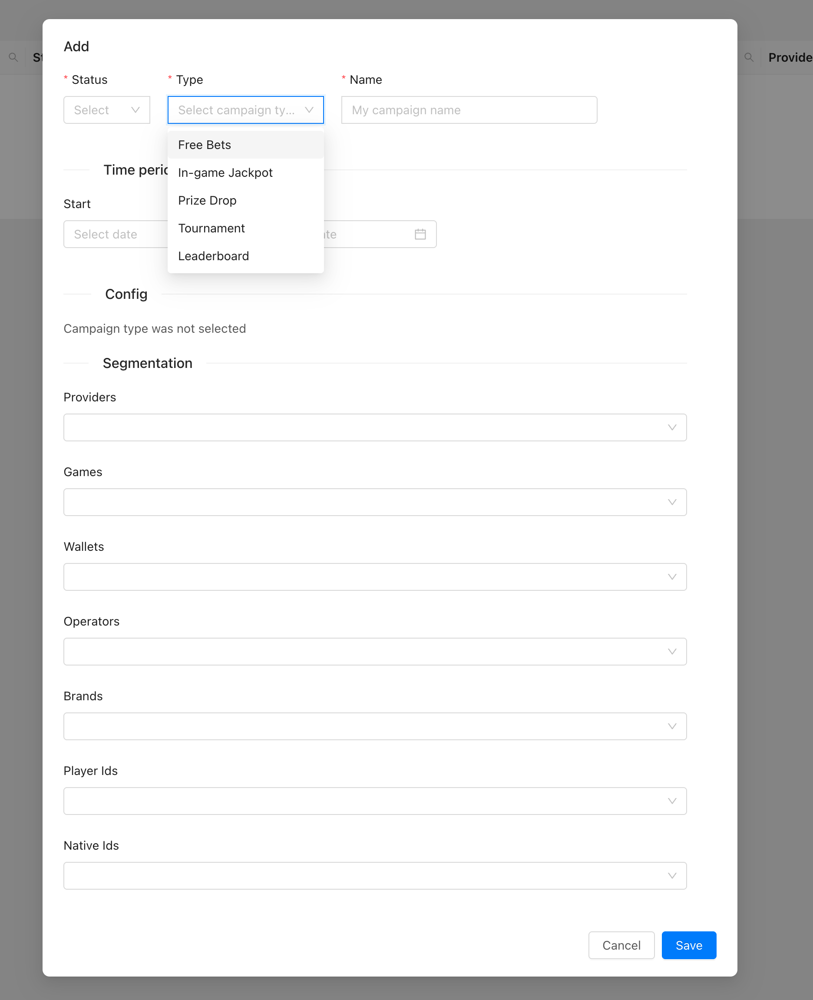  
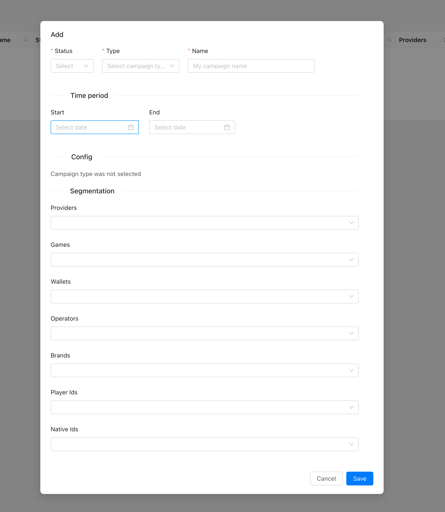

| Field            | Mandatory         | Notes                                                                                                                                              |
| ---------------- | ----------------- | -------------------------------------------------------------------------------------------------------------------------------------------------- |
| **Status**       | Yes               | `enabled`, `disabled`                                                                                                                              |
| **Type**         | Yes               | Reward logic – _Free Bets_, _Prize Drop_, _Tournament_, _Leaderboard_, _In‑game Jackpot_. The form expands once selected.                          |
| **Name**         | Yes               | Title of specific Campaign                                                                                                                         |
| **Time period**  | Yes               | **Start** / **End** timestamps (UTC).                                                                                                              |
| **Config**       | Depends on _Type_ | e.g. reward amount, jackpot contribution, leaderboard rules.                                                                                       |
| **Segmentation** | Optional          | Multi‑select filters (`Providers`, `Games`, `Wallets`, `Operators`, `Brands`, `Player Ids`, `Native Ids`). All filters combine with **AND** logic. |

**Workflow**

1. Click **Add** in the Campaign list.
2. Fill mandatory fields (red asterisk).
3. Press **Save** to save campaign

> **Tip:** **Export** buttons exports CSV.

---

#### Themes <!-- id="themes" -->

**Screenshots**  
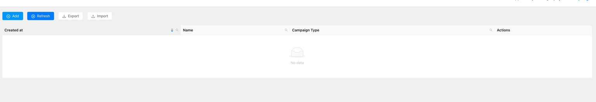  
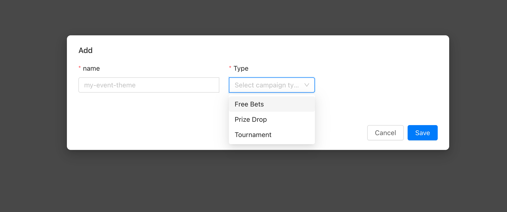

| Field    | Mandatory | Description                                                    |
| -------- | --------- | -------------------------------------------------------------- |
| **name** | Yes       | Unique slug (letters, numbers, hyphens). Visible to operators. |
| **type** | Yes       | Preset category – _Free Bets_, _Prize Drop_, _Tournament_.     |

Themes bundle reusable styling & config (banner colours, notification copy, reward unit). Campaigns referencing a theme inherit these defaults but can override per‑campaign.

_Creating a theme_

1. Click **Add**.
2. Enter a _name_ in kebab‑case (`my-event-theme`).
3. Pick a _Type_ from the list.
4. **Save**. The theme appears in the grid and becomes selectable inside campaign forms.

## <!-- END_PROMO -->

<!-- BEGIN_REPORTS -->

## Reports <!-- id="reports" -->

### Overview

The **Reports** module offers on‑demand analytics for product, finance and compliance teams.

| Sub‑section   | Typical Role    | Purpose                                 |
| ------------- | --------------- | --------------------------------------- |
| Game Win      | Finance Analyst | Gross Gaming Revenue (GGR) by dimension |
| Report Sender | BI Engineer     | Not available yet                       |

#### Game Win <!-- id="game-win" -->

**Screenshots**  
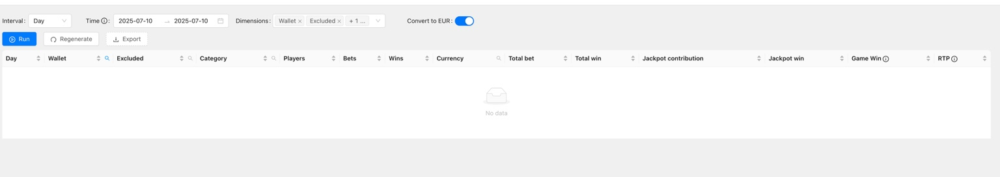  
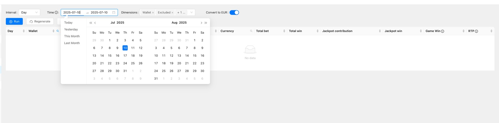  
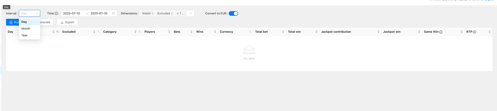

| Control              | Description                                                           |
| -------------------- | --------------------------------------------------------------------- |
| **Interval**         | Aggregation bucket: _Day_, _Month_, _Year_.                           |
| **Time ⌀**           | Start/end date picker; supports manual ISO input.                     |
| **Dimensions**       | Multi‑select breakdowns (`Wallet`, `Excluded`, `Player group`, etc.). |
| **Convert to EUR**   | Toggle; converts monetary columns using _Fixed Rates_ if ON.          |
| **Run / Regenerate** | **Run** executes query; **Regenerate** forces cache bypass.           |
| **Export**           | Downloads current result as CSV.                                      |

**Returned columns**

`Day`, `Wallet`, `Excluded`, `Category`, `Players`, `Bets`, `Wins`, `Currency`, `Total bet`, `Total win`, `Jackpot contribution`, `Jackpot win`, `Game Win`, `RTP`.

> **RTP tooltip:** Hover the info icon in the header to view calculation details.

_Typical usage_

1. Set `Interval → Month`.
2. Choose date range.
3. Add `Wallet` + `Operator` dimensions.
4. Click **Run** → **Export** to CSV.

#### Report Sender <!-- id="report-sender" -->

_Not Available Yet_

## <!-- END_REPORTS -->

<!-- BEGIN_SYSTEM -->

## System <!-- id="system" -->

### Overview

System is the admin heart‑beat: user accounts, game metadata, wallet & RGS connections, etc.

| Sub‑section | Typical Role     | Purpose                      |
| ----------- | ---------------- | ---------------------------- |
| Accounts    | SysAdmin         | Manage BO user logins        |
| RGS's       | TechOps          | Register Remote Game Servers |
| Wallets     | Integration Eng. | Configure wallet endpoints   |
| Games       | Content Ops      | Game catalogue management    |
| Rooms       | Operations       | Multiplayer room rules       |
| Settings    | SysAdmin         | Global feature switches      |

### Permissions

| Permission key        | Module / Area    | What it lets you do                                    |
| --------------------- | ---------------- | ------------------------------------------------------ |
| wallets               | System           | View configured wallets and their details              |
| manageWallets         | System           | Add/edit/remove wallets, change endpoints/keys         |
| verifier              | APIs             | Use wallet/game verifier tools to validate integration |
| graphiql              | APIs             | Open GraphiQL console and run queries/mutations        |
| rgss                  | System           | View RGS's list                                        |
| manageRgss            | System           | Register/edit/remove RGS connections                   |
| accounts              | System           | See user accounts list and details                     |
| manageAccounts        | System           | Create/edit/disable BO users, set roles, whitelist IPs |
| players               | Customer Service | Search player profiles, notes, KYC flags               |
| managePlayers         | Customer Service | Edit player data/statuses (exclusions, limits, etc.)   |
| currencyExchange      | Currencies       | View exchange rate feeds                               |
| fixedCurrencyRates    | Currencies       | See configured fixed FX rates                          |
| manageCurrencies      | Currencies       | Edit feeds, fixed rates, aliases                       |
| currencyAliases       | Currencies       | View currency alias mapping                            |
| gameWin               | Reports          | Run the Game Win report                                |
| regenerateGameWin     | Reports          | Force a fresh Game Win calculation                     |
| transactions          | Customer Service | Browse transactions list and details                   |
| closeTransaction      | Customer Service | Perform manual operations on Transactions              |
| manageCampaigns       | Promo            | Build and control promo campaigns                      |
| campaigns             | Promo            | View existing campaigns                                |
| manageThemes          | Promo            | Create/edit promo themes                               |
| availableBets         | APIs/Tools       | Query list of available bets                           |
| auditLogs             | APIs/Compliance  | View API/BO audit logs                                 |
| criticalFiles         | Compliance       | Access list of critical file submissions               |
| manageCriticalFiles   | Compliance       | Upload/approve critical files                          |
| rtpMonitoring         | Compliance       | View RTP dashboards/alerts                             |
| manageRtpMonitoring   | Compliance       | Adjust RTP dashboard settings                          |
| games                 | System           | View game catalogue                                    |
| manageGames           | System           | Add/edit game metadata, categories etc.                |
| sessions              | Customer Service | Inspect player sessions                                |
| endSession            | Customer Service | Force-close an active session                          |
| gameplay              | Reports/Tools    | Access round/hand-level gameplay details               |
| rooms                 | System           | View multiplayer rooms                                 |
| manageRooms           | System           | Configure room parameters                              |
| reportSender          | Reports          | See scheduled report definitions                       |
| manageReportSender    | Reports          | Create/edit report schedules and recipients            |
| reportExclusion       | Reports          | View players exclusions                                |
| manageReportExclusion | Reports          | Create/edit players exclusions                         |
| settings              | System           | View custom settings within BO env                     |
| manageSettings        | System           | Change custom settings within BO env                   |

#### Accounts <!-- id="accounts" -->

**Screenshots**  
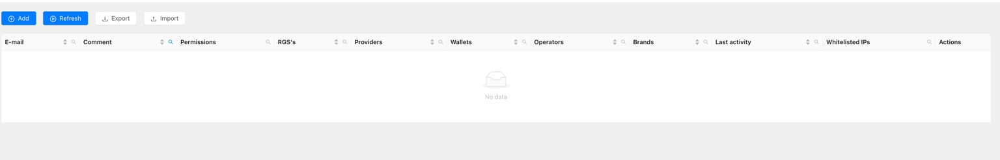  
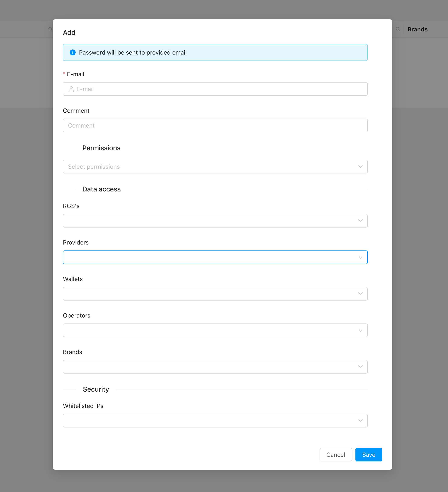

_Grid columns_  
`E‑mail`, `Comment`, `Permissions`, `RGS's`, `Providers`, `Wallets`, `Operators`, `Brands`, `Last activity`, `Whitelisted IPs`, `Actions`.

_Adding a new account_

1. **Add** → modal opens.
2. **E‑mail** (required) → initial password auto‑emailed.
3. **Permissions** → multi‑select
4. **Data access** → scope narrowed down by RGS / Provider / Wallets/ Operators/ Brands
5. **Whitelisted IPs** (optional) → comma‑separated IPv4/IPv6.
6. **Save** → account appears enabled by default.

> **Import tip:** Use the **Import** button with CSV matching grid column names for bulk uploads.

#### RGS's <!-- id="rgss" -->

The **RGS’s** screen is where you register and maintain Remote Game Server connections **per environment** (prod / stage / dev).  
Settings entered here must match the adapter’s own configuration on the RGS side; otherwise calls will fail or payloads won’t be inspected correctly.

**Add / Edit form fields**

| Field                 | Required | Description                                                                                                                                                                          |
| --------------------- | -------- | ------------------------------------------------------------------------------------------------------------------------------------------------------------------------------------ |
| **Id**                | Yes      | Internal unique key (immutable once saved). Use a short, lowercase slug (e.g. `abc-prod`).                                                                                           |
| **Adapter**           | Yes      | Name of the integration adapter.                                                                                                                                                     |
| **Config**            | Yes      | JSON block with runtime settings. Provide **environment-specific values** here.                                                                                                      |
| **Inspection config** | Yes      | JSON describing how to validate/inspect incoming/outgoing payloads (schemas, signature headers, hash keys, ignored fields). Tune this per environment if dev/stage differ from prod. |
| **Whitelisted IPs**   | No       | Comma-separated list allowed to hit the endpoints, if enforced by your network rules.                                                                                                |

> ⚠️ **Some changes require restarting the adapter.** After updating `Config` or `Inspection config`, restart the corresponding adapter service/pod so new values are picked up.

**Typical workflow**

1. Click **Add**.
2. Define a stable **Id** and pick the proper **Adapter**.
3. Paste the environment’s JSON into **Config**.
4. Paste/adjust the validation rules in **Inspection config**.
5. (Optional) Restrict access via **Whitelisted IPs**.
6. **Save** and, restart the adapter.

**Tips**

- Use comments-free, valid JSON—malformed entries will block the adapter from starting.

#### Wallets <!-- id="wallets" -->

Use **Wallets** to configure how the platform talks to each external wallet **per environment/operator**.  
JSON blocks here must mirror what the wallet adapter expects in that environment.

> ⚠️ **Some changes require restarting the adapter.** If you edit specific wallet, restart the wallet adapter service/pod.

**Grid (for context)**  
`Id`, `Adapter`, `Group`, `Status`, `Key cache expiry`, `Email`, `Config`, `Inspection config`, `Excluded`, `IP blocked`, `Geo IP blocked`, `Whitelisted IPs`.

**Add / Edit form fields**

| Field                          | Req. | Description                                                                                                                                                   |
| ------------------------------ | :--: | ------------------------------------------------------------------------------------------------------------------------------------------------------------- |
| **Id**                         | ✔︎  | Immutable internal key (e.g. `walletabc`). Lowercase/kebab-case recommended.                                                                                  |
| **Group**                      |      | Optional logical grouping.                                                                                                                                    |
| **Status**                     | ✔︎  | `enabled` / `disabled`. Disabled wallets are ignored by runtime.                                                                                              |
| **Email**                      |      | Contact for alerts (callback failures, inspection errors). One address or comma-separated list.                                                               |
| **Adapter**                    | ✔︎  | Adapter implementation name (e.g. `standard`, `operatorx`). Determines which code is used. Standard (Adapter API integrated), Custom (Partner API integrated) |
| **Key cache expiry (seconds)** |      | TTL for caching wallet keys/tokens. Blank = use adapter default.                                                                                              |
| **Config**                     | ✔︎  | JSON with runtime settings: base URLs, credentials, secrets, timeout values, type of methods (ex. if POST required) **Environment specific**.                 |
| **Inspection config**          | ✔︎  | JSON rules for payload validation/logging (schemas, signature headers, hash keys, ignored fields). Tune per env if dev/stage differ.                          |
| **Excluded**                   |      | Flag to omit this wallet from reports/metrics (e.g. test wallets, demo).                                                                                      |
| **Parallel transactions**      |      | Allow/reject overlapping transactions for the same player/round.                                                                                              |
| **IP blocked**                 |      | Toggle to block requests coming **from** this wallet’s IPs (useful for maintenance).                                                                          |
| **Geo IP blocked**             |      | Toggle to block players by geo-IP at wallet level.                                                                                                            |
| **Whitelisted IPs**            |      | Comma-separated lists allowed to call the adapter endpoints (enforced by BO).                                                                                 |

**Typical workflow**

1. **Add** a new wallet.
2. Choose a stable **Id** and correct **Adapter**.
3. Paste environment values into **Config** and **Inspection config**. Validate JSON before saving.
4. Optionally set TTL, exclusion/blocked flags, and IP whitelist.
5. **Save**. If prompted, restart the adapter to apply changes.

**Tips**

- Use strict JSON (no comments/trailing commas) to avoid adapter startup failures.

#### Games <!-- id="games" -->

The **Games** screen is the catalogue that maps each game code to its RGS adapter settings and defines where the game is available (wallets/operators/brands).

**Grid columns (for reference)**  
`Game`, `Title`, `Type`, `Provider`, `RGS`, `RGS Game`, `RGS config`, `Inspection config`, `Wallets`, `Operators`, `Brands`, `Actions`.

---

##### Add / Edit form fields

| Field                        | Req. | Description                                                                                                        |
| ---------------------------- | :--: | ------------------------------------------------------------------------------------------------------------------ |
| **Game**                     | ✔︎  | Internal game code ID (slug). Must be unique. Example: `gameAbc`, `game-xyz`. Choose one convention for all games. |
| **Title**                    |      | Human-readable name shown in reports/back office.                                                                  |
| **Type**                     |      | Classification such as `slot`, `tableGame`, `other` – used for filtering and RTP grouping.                         |
| **Provider**                 | ✔︎  | Name of the content provider (matches the one used in RGS/Reports).                                                |
| **RGS**                      | ✔︎  | Which RGS entry this game belongs to (must exist in **RGS’s** module).                                             |
| **RGS Game**                 |      | Provider-specific identifier if it differs from our `Game` code. Helpful when provider uses another ID.            |
| **RGS config**               | ✔︎  | JSON passed to the adapter for this specific game.                                                                 |
| **Inspection config**        | ✔︎  | JSON describing validation rules for this game’s payloads (schemas, ignored fields, etc.).                         |
| **Availability → Wallets**   |      | Multi-select of wallets where this game can be launched. Leave empty for “all”.                                    |
| **Availability → Operators** |      | Limit visibility to specific operators.                                                                            |
| **Availability → Brands**    |      | Limit visibility to specific brands/skins.                                                                         |

> ⚠️ If enter wallet name and brand name - and for example under wallet you will have more than one brand (specified), all will needs to be added.

**Typical workflow**

1. Click **Add**.
2. Enter the unique **Game** code and optional **Title/Type**.
3. Select the correct **Provider** and **RGS** (and `RGS Game` if provider uses another key).
4. Paste/adjust **RGS config** and **Inspection config** JSON.
5. Under **Availability**, pick wallets/operators/brands that may expose the game (or leave blank for global).
6. **Save**. Use **Export/Import** for bulk updates across environments.

**Tips**

- When deprecating a game, set its availability lists to empty or remove it entirely to prevent launches.

#### Rooms <!-- id="rooms" -->

A **Room** is a configurable wrapper around a game (usually multiplayer or RTP-tuned variants).  
Here you define RTP, availability scopes and special options like **Provably Fair RNG**.

**Grid columns (reference):**  
`Created at`, `Status`, `Name`, `Provider`, `Game`, `Min bet`, `Max bet`, `Currencies`, `Wallets`, `Operators`, `Brands`, `Actions`.

---

##### Add / Edit form fields

| Field                         | Req. | Description                                                            |
| ----------------------------- | :--: | ---------------------------------------------------------------------- |
| **Status**                    | ✔︎  | `enabled` / `disabled`. Disabled rooms cannot be launched.             |
| **Name**                      | ✔︎  | Unique slug for the room (e.g. `gamex-room-99`).                       |
| **Provider**                  | ✔︎  | Content provider name (same as in _Games_).                            |
| **Game**                      | ✔︎  | Game code this room belongs to (must exist in _Games_).                |
| **Config**                    | ✔︎  | JSON with room-level settings.                                         |
| **Min bet / Max bet**         |      | Optional hard limits overriding game defaults. Leave blank to inherit. |
| **Availability → Currencies** |      | Restrict room to specific currencies.                                  |
| **Availability → Wallets**    |      | Limit to certain wallets only.                                         |
| **Availability → Operators**  |      | Operator-level visibility filter.                                      |
| **Availability → Brands**     |      | Brand-level visibility filter.                                         |
| **Provably Fair RNG**         |      | Toggle to use the Provably Fair chain for this room.                   |
| **Chain Length**              |      | Size of the seed chain when PF RNG is enabled.                         |

---

**Typical workflow**

1. **Add** a room → set **Status = enabled** only when ready.
2. Choose **Provider** and **Game**.
3. Paste valid JSON into **Config** (no comments/trailing commas).
4. Define betting limits if needed.
5. Scope availability (currencies/wallets/operators/brands).
6. Enable **Provably Fair RNG** and set **Chain Length** if the game supports it.
7. **Save**. Use **Export / Import** for bulk room creation.

> Keep one room per distinct configuration (e.g., different RTP %, bet range or currency set). Re-using rooms across operators eases maintenance but be mindful of availability filters.

#### Settings <!-- id="settings" -->

Settings are key‑value records that cascade across scopes (**Wallet**, **Operator**, **Brand**, **Provider**, **Game**, **Jurisdiction**). When multiple records share a key, the platform selects the entry with the **highest priority** that matches the current play context. Null in a column means “all”.

**Visibility:** `serverOnly=true` hides the setting from the game client `/info/` call; otherwise it is exposed.

**Common predefined keys**

| Key                  | Description                                                                      | Example / Type                         |
| -------------------- | -------------------------------------------------------------------------------- | -------------------------------------- |
| maxExposure          | Max total liability the game/room can hold at once (sum of active bets/payouts). | `50000` (number)                       |
| minBet               | Smallest allowed wager.                                                          | `0.10` (number)                        |
| maxBet               | Largest single wager allowed.                                                    | `1000` (number)                        |
| maxBonusBet          | Cap for wagers made with bonus funds/free bets.                                  | `50` (number)                          |
| defaultBet           | Pre-filled bet amount shown to the player.                                       | `1` (number)                           |
| gameVariant          | Internal code for a specific rule set / skin.                                    | `RGS defined values`                   |
| mainBets             | Primary bet types available.                                                     | `mainBets naming`                      |
| availableBets        | Complete list of bet options (main + side bets).                                 | `json interpretation of availableBets` |
| autoCompleteHours    | Hours after which unfinished rounds auto-complete.                               | `24` (integer)                         |
| autoCompleteDisabled | Turns auto-complete off when `true`.                                             | `true/false`                           |
| depositRetries       | How many times to retry a failed deposit call.                                   | `3` (integer)                          |
| cancelRetries        | How many times to retry a failed cancel/rollback call.                           | `3` (integer)                          |
| retriesExpiryHours   | Lifetime of retry records before giving up.                                      | `72` (integer)                         |
| provablyFair         | Enables Provably Fair RNG chain for this entity.                                 | `true/false`                           |
| maxDecimals          | Allowed decimal precision for bet amounts.                                       | `2` (integer)                          |
| parallelRounds       | Whether multiple active rounds per player are allowed (or numeric limit).        | `true/false`                           |
| hidePromoOptOut      | Hides the “promo opt-out” toggle in UI.                                          | `true/false`                           |
| gameEnabled          | Master switch.                                                                   | `true/false`                           |

##### Bet Management <!-- id="settings-bet-management" -->

Based on available bets and theoretical maximum win (`maxWin`) specified in the game server and values from Settings, the server calculates bets accepted by the system.

Available bets are expressed in the environment's base currency (`process.env.BASE_CURRENCY`) and are used as the basis for bet conversions via the [Fixed Currency exchange rates system](#currencies-fixed).

Maximal potential win `maxWin` is expressed as a **multiple** of the initial bet (e.g., `maxWin: 1000` means a player can win up to 1000 times the bet).

Each bet must fulfill **all** of the following:

- `bet >= minBet`
- `bet <= maxBet`
- `bet <= maxBonusBet` _(only for bets different from `main`)_
- `bet * maxWin < maxExposure`

After validation, all bets are converted to the player's currency using Fixed Currency Exchange Rates.

##### Auto completion <!-- id="settings-auto-completion" -->

Interrupted rounds (player left, lost connectivity, multi‑step game not finalised) can auto‑complete after **autoCompleteHours**. If player choice is required, the platform asks the game server to resolve. Disable with `autoCompleteDisabled=true`.

##### Workflow

1. **Add** → open the form.
2. Fill **Key** and **Value** (both required).
3. (Optional) Add a **Comment** explaining why this override exists.
4. Choose **Server only = Yes** if the key should never be exposed to clients (backend-only logic).
5. Scope the setting by selecting one or more of: _Wallets, Operators, Brands, Providers, Games, Jurisdictions, Currencies_.
6. Set **Priority** (integer).
7. **Save**. The row appears in the list and is applied immediately.

<!-- END_SYSTEM -->

<!-- BEGIN_CURRENCIES -->

## Currencies <!-- id="currencies" -->

The **Currencies** module lets you review and manage all exchange-rate data that drives in‑game bet conversion, reporting conversions, and display formatting across Back Office. Rates are maintained through a combination of **daily feed imports**, **operator‑defined fixed multipliers**, and optional **aliases** for mapping wallet / partner currency codes to platform currencies.

> **Base currency:** The platform base is typically `eur` and acts as the pivot for all conversions (feeds and fixed).

### Feeds <!-- id="currencies-feeds" -->

Currency exchange rates are downloaded every day (rates from the day before).

Two feeds are used:

- `currencylayer.com` for FIAT currencies (free and paid plans available, requires an API key)
- `coinapi.io` for cryptocurrencies (free and paid plans available, requires an API key)

### Exchange Rates <!-- id="currencies-exchange" -->

The **Exchange Rates** grid shows the most recent feed‑based market rates normalised to the platform base currency. These are _reference_ values; game bet display normally uses **Fixed Rates** (below) for aesthetic bet steps, but reporting modules (e.g., Transactions “Convert to EUR”) rely on exchange rates for financial consistency.

### Fixed Currency Exchange Rates <!-- id="currencies-fixed" -->

The platform comes with a system to conveniently and securely convert game bets to good‑looking, human‑readable values in different currencies (e.g. `1eur = 10sek`, `1eur = 5pln`, `1eur = 100jpy`).

The system populates these fixed rates during the initial deployment to predefined values adjusted to reflect market requirements for each currency.
They can be adjusted via Back Office at any time.

### Aliases <!-- id="currencies-aliases" -->

Some upstream wallets / partners send non‑standard currency codes (e.g., `GC.` fun‑play credits, branded token symbols, or scaled crypto units). Use **Aliases** to map those codes onto an existing platform currency with an additional multiplier, letting you present correct bet ladders and reporting without adding a full new currency. Typical cases: mapping `btc` → internal `ubtc` micro‑unit; mapping partner ‘GC.’ to an alias that scales by 1,000,000.

_Creating an alias_

1. **Add** → specify **Alias code**, **Base currency**, **Multiplier**, **Symbol**.
2. Save; the alias appears in lists and becomes selectable in wallet / brand mappings.
3. Combine with Fixed Rates to fine‑tune bet steps per partner brand.
 <!-- END_CURRENCIES -->

<!-- BEGIN_COMPLIANCE -->

## Compliance <!-- id="compliance" -->

The **Compliance** module centralises platform controls that help satisfy technical / regulatory requirements: _critical file integrity_, _mathematical return (RTP) surveillance_, plus additional partner‑specific checksums tools. These controls can raise alerts and, if configured, block game traffic when material issues are detected.

### Critical Files Verification <!-- id="compliance-critical-files" -->

Files certified as _critical_ can be listed in Back Office along with their checksums.  
The system verifies that files existing on the servers match the declared checksum.

Checks are executed:

- on system startup
- periodically every 12h
- per request from Back Office

When a mismatch is detected the system sends alert e‑mails to support.  
In case of repeated checksum verification failure (so in at most 24h), the system blocks server communication **if** the file is marked as _system blocking_.

### RTP Monitoring <!-- id="compliance-rtp-monitoring" -->

Game (and Variant) RTP can be registered in the RTP monitoring system.  
The platform tracks the normalised expected value of the game algorithm in a rolling two‑week window.

The values can be reviewed in Back Office.  
If RTP drifts outside the (automatically calculated) 99.9% confidence interval, an alert e‑mail is sent to review the game's performance.

<!-- END_COMPLIANCE -->

<!-- BEGIN_APIS -->

## APIs <!-- id="apis" -->

Back Office exposes several developer‑facing utilities and diagnostics endpoints. Most are powered by the platform’s GraphQL layer and can be permission‑scoped per Back Office account.

### Audit Logs <!-- id="apis-audit-logs" -->

Each query and mutation call can be logged for audit purposes using the `@log` directive. Parameters `variables` and `result` indicate whether those should be saved too or skipped.

```graphql
directive @log(variables: Boolean, result: Boolean) on FIELD_DEFINITION
type Query {
    test: Boolean! @log(variables: true, result: true)
}
```

### Wallet Verifier <!-- id="apis-wallet-verifier" -->

Interactive tool that lets you simulate wallet API calls (authenticate, balance check, deposit, withdraw) against configured wallet adapters without launching a game. Helpful during on‑boarding and when troubleshooting stuck transactions.

### Game Verifier <!-- id="apis-game-verifier" -->

Launch a headless round against an RGS endpoint to confirm launch params, bet ladder, and callback health. Supports replaying historical rounds by roundId.

### GraphiQL <!-- id="apis-graphiql" -->

Embeds an authenticated GraphiQL explorer so engineers can inspect schema, run ad‑hoc queries/mutations, and review responses (subject to permission scopes). Remember to enable `@log` on sensitive operations if auditability is required.

<!-- END_APIS -->
