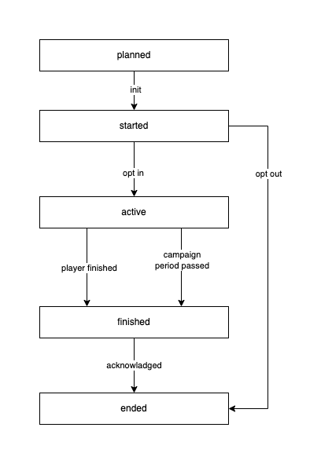

# Promo Tool Development

## Campaign Flow

### Overlapping campaigns

Only one campaign of a given type is returned at a time. Multiple campaigns of different types can be processed in parallel

### Statuses

Campaign can be in one of below statuses.

- `planned`: campaign is scheduled for later time
- `started`: campaign period has started and player needs to opt in or out
- `active`: player has opted in and is participating in the campaign
- `finished`: campaign time ended or player finished its campaign
- `ended`: campaign not returned via API



## Campaign Tool

### Idempotency

All methods are idempotent. Responses from tool methods are stored so in case of double requests tool methods are not called again

### Tool methods

#### `create`

Creates the initial state of the campaign. It is called after the campaign is created. If the configuration is not correct it should throw an error.<br/>
If the method is not specified it will assume it is correct by default and store campaign with empty state.

REQUIRED: `no`

**Arguments**

| Name | Type             | Example | Description                            |
|------|------------------|---------|----------------------------------------|
| `.`  | `ICampaignSetup` |         | [See ICampaignSetup](#ICampaignSetup)  |

**Returns**

ICampaignState or `void`

Example:

```
export const myTool: ITool<ICampaignConfig, IPlayerState, ICampaignState> = {
    async create({config}) {
        if (config.amount <= 0) throw new Exception("Amount should be greater then zero");
    },
    
    return { amountLeft: config.amount };
};
```


#### `edit`

Edits the current state of the campaign. It is called after the campaign is edited. If the configuration is not correct it should throw an error.<br/>
If the method is not specified it will assume it is correct by default and will not modify the state of the campaign.<br/>
If the method doesn't return value, the state of campaign will not be altered.

REQUIRED: `no`

**Arguments**

| Name                      | Type             | Example | Description                            |
|---------------------------|------------------|---------|----------------------------------------|
| `previousCampaignSetup`   | `ICampaignSetup` |         | [See ICampaignSetup](#ICampaignSetup)  |
| `previousCampaignState`   | `ICampaignState` |         | [See ICampaignState](#ICampaignState)  |
| `newCampaignSetup`        | `ICampaignSetup` |         | [See ICampaignSetup](#ICampaignSetup)  |

**Returns**

ICampaignState or `void`

Example:

```
export const myTool: ITool<ICampaignConfig, IPlayerState, ICampaignState> = {
    async edit(_, { amountLeft }, newCampaignSetup) {
        if (newCampaignSetup.config.amount < amountLeft) throw new Exception("New amount cannot be less the amount left in the current Campaign state");
    },
    
    return { amountLeft: newCampaignSetup.config.amount };
};
```

---

#### `visible`

Specifies if the campaign is visible to the player

REQUIRED: `no`

**Arguments**

| Name     | Type              | Example                                                                 | Description                             |
|----------|-------------------|-------------------------------------------------------------------------|-----------------------------------------|
| `config` | `ICampaignConfig` | `{amount: 10}`                                                          | [See ICampaignConfig](#ICampaignConfig) |
| `player` | `IPlayer`         | `{playerId: "dcd95186-dd97-4173-8cd2-ad294762eddd", wallet: "myWallet}` | [See IPlayer](#IPlayer)                 |

**Returns**

| Name | Type      | Required   | Example | Description         |
|------|-----------|------------|---------|---------------------|
| `.`  | `boolean` | `REQUIRED` | `true`  | Campaign visibility |

Example:

```
export const myTool: ITool = {
    async visible({config, player}) {
        return ["mt", "uk", "se"].includes(player.jurisdiction);
    },
};
```

---

#### `init`

Initializes the player state, runs during first player authentication before players joins the campaign.

REQUIRED: `no`

**Arguments**

| Name                 | Type                           | Example                                                                 | Description                             |
|----------------------|--------------------------------|-------------------------------------------------------------------------|-----------------------------------------|
| `config`             | `ICampaignConfig`              | `{amount: 10}`                                                          | [See ICampaignConfig](#ICampaignConfig) |
| `player`             | `IPlayer`                      | `{playerId: "dcd95186-dd97-4173-8cd2-ad294762eddd", wallet: "myWallet}` | [See IPlayer](#IPlayer)                 |
| `loadCampaignState`  | `()=>Promise<ICampaignState>`  |                                                                         | [See Loading State](#Loading-state)     |

**Returns**

It can return `void` or below object:

| Name          | Type     | Required   | Example                              | Description                       |
|---------------|----------|------------|--------------------------------------|-----------------------------------|
| `playerState` | `any`    | `OPTIONAL` | `{b: 456}}`                          | [See IPlayerState](#IPlayerState) |
| `logs`        | `ILog[]` | `OPTIONAL` | `{name: "my log", data: {a: 123}}}}` | [See ILog](#ILog)                 |

Example:

```
export const myTool: ITool = {
    async init({config, player}) {
        const playerState = {myData: [1, 2, 3]};
        return {playerState};
    },
};
```

---

#### `opt`

Called when player decided to opt in or out. It is also called when `autoOptIn` is enabled.

REQUIRED: `no`

**Arguments**

| Name                | Type                          | Required                                                                | Example                                 | Description |
|---------------------|-------------------------------|-------------------------------------------------------------------------|-----------------------------------------|-------------|
| `optIn`             | `boolean`                     | `true`                                                                  | Specifies if a player opted in or out   |
| `config`            | `ICampaignConfig`             | `{amount: 10}`                                                          | [See ICampaignConfig](#ICampaignConfig) |
| `player`            | `IPlayer`                     | `{playerId: "dcd95186-dd97-4173-8cd2-ad294762eddd", wallet: "myWallet}` | [See IPlayer](#IPlayer)                 |
| `loadPlayerState`   | `()=>Promise<IPlayerState>`   |                                                                         | [See Loading State](#Loading-state)     |
| `loadCampaignState` | `()=>Promise<ICampaignState>` |                                                                         | [See Loading State](#Loading-state)     |

**Returns**

It can return `void` or below object:

| Name            | Type     | Required   | Example                              | Description                           |
|-----------------|----------|------------|--------------------------------------|---------------------------------------|
| `campaignState` | `any`    | `OPTIONAL` | `{a: 123}}`                          | [See ICampaignState](#ICampaignState) |
| `playerState`   | `any`    | `OPTIONAL` | `{b: 456}}`                          | [See IPlayerState](#IPlayerState)     |
| `logs`          | `ILog[]` | `OPTIONAL` | `{name: "my log", data: {a: 123}}}}` | [See ILog](#ILog)                     |

Example:

```
export const myTool: ITool = {
    async opt({optIn, loadCampaignState}) {
        //counts number of players who opted in and out
        const campaignState = await loadCampaignState() || {optedIn: 0, optedOut: 0};
        if (optIn) {
            campaignState.optedIn++;
        } else {
            campaignState.optedOut++;
        }
        return {campaignState};
    },
};
```

---

#### `acknowladged`

Called when player confirmed seeing final campaign summary (i.e. popup with prize awarded).

REQUIRED: `no`

**Arguments**

| Name                | Type                          | Example                                                                 | Description                             |
|---------------------|-------------------------------|-------------------------------------------------------------------------|-----------------------------------------|
| `config`            | `ICampaignConfig`             | `{amount: 10}`                                                          | [See ICampaignConfig](#ICampaignConfig) |
| `player`            | `IPlayer`                     | `{playerId: "dcd95186-dd97-4173-8cd2-ad294762eddd", wallet: "myWallet}` | [See IPlayer](#IPlayer)                 |
| `loadPlayerState`   | `()=>Promise<IPlayerState>`   |                                                                         | [See Loading State](#Loading-state)     |
| `loadCampaignState` | `()=>Promise<ICampaignState>` |                                                                         | [See Loading State](#Loading-state)     |

**Returns**

It can return `void` or below object:

| Name            | Type     | Required   | Example                              | Description                           |
|-----------------|----------|------------|--------------------------------------|---------------------------------------|
| `campaignState` | `any`    | `OPTIONAL` | `{a: 123}}`                          | [See ICampaignState](#ICampaignState) |
| `playerState`   | `any`    | `OPTIONAL` | `{b: 456}}`                          | [See IPlayerState](#IPlayerState)     |
| `logs`          | `ILog[]` | `OPTIONAL` | `{name: "my log", data: {a: 123}}}}` | [See ILog](#ILog)                     |

Example:

```
export const myTool: ITool = {
    async acknowladged({optIn, loadCampaignState}) {
        //counts number of players who acknowladged
        const campaignState = await loadCampaignState() || {acknowladged: 0};
        campaignState.acknowladged++;
        return {campaignState};
    },
};
```

---

#### `withdraw`

Withdrawal is obout to be made.

REQUIRED: `no`

**Arguments**

| Name                | Type                          | Example                                                                 | Description                             |
|---------------------|-------------------------------|-------------------------------------------------------------------------|-----------------------------------------|
| `config`            | `ICampaignConfig`             | `{amount: 10}`                                                          | [See ICampaignConfig](#ICampaignConfig) |
| `player`            | `IPlayer`                     | `{playerId: "dcd95186-dd97-4173-8cd2-ad294762eddd", wallet: "myWallet}` | [See IPlayer](#IPlayer)                 |
| `loadPlayerState`   | `()=>Promise<IPlayerState>`   |                                                                         | [See Loading State](#Loading-state)     |
| `loadCampaignState` | `()=>Promise<ICampaignState>` |                                                                         | [See Loading State](#Loading-state)     |
| `transaction`       | `ITransaction`                |                                                                         | [See ITransaction](#ITransaction)       |

**Returns**

It can return `void` or below object:

| Name            | Type       | Required   | Example                                                                                   | Description                                        |
|-----------------|------------|------------|-------------------------------------------------------------------------------------------|----------------------------------------------------|
| `campaignState` | `any`      | `OPTIONAL` | `{a: 123}}`                                                                               | [See ICampaignState](#ICampaignState)              |
| `playerState`   | `any`      | `OPTIONAL` | `{b: 456}}`                                                                               | [See IPlayerState](#IPlayerState)                  |
| `prizes`        | `IPrize[]` | `OPTIONAL` | `[{"playerId:"abc11123-dd97-4173-8cd2-ad294762eddd", type: "cash", data: {amount: 100}}}` | [See IPrize](#IPrize)                              |
| `finished`      | `any`      | `OPTIONAL` | `false`                                                                                   | Indicates if campaign has finished for this player |
| `free`          | `any`      | `OPTIONAL` | `false`                                                                                   | Marks transaction as free bet                      |
| `jackpotAmount` | `number`   | `OPTIONAL` | `0.20`                                                                                    | Part of amount that is jackpot win                 |
| `logs`          | `ILog[]`   | `OPTIONAL` | `{name: "my log", data: {a: 123}}}}`                                                      | [See ILog](#ILog)                                  |

Example:

```
export const myTool: ITool = {
    async withdraw(player: { playerId }) {
        if (Math.random() > 0.5) {
            return {prizes: [{playerId, type: "cash", data: {amount: 100}}]};
        }
    },
};
```

---

#### `withdrawFinished`

Withdrawal is successfully finished.

REQUIRED: `no`

**Arguments**

| Name                | Type                          | Example                                                                 | Description                                       |
|---------------------|-------------------------------|-------------------------------------------------------------------------|---------------------------------------------------|
| `config`            | `ICampaignConfig`             | `{amount: 10}`                                                          | [See ICampaignConfig](#ICampaignConfig)           |
| `player`            | `IPlayer`                     | `{playerId: "dcd95186-dd97-4173-8cd2-ad294762eddd", wallet: "myWallet}` | [See IPlayer](#IPlayer)                           |
| `loadPlayerState`   | `()=>Promise<IPlayerState>`   |                                                                         | [See Loading State](#Loading-state)               |
| `loadCampaignState` | `()=>Promise<ICampaignState>` |                                                                         | [See Loading State](#Loading-state)               |
| `transaction`       | `ITransaction`                |                                                                         | [See ITransaction](#ITransaction)                 |
| `start`             | `Date`                        | `new Date()`                                                            | Campaign start date                               |
| `end`               | `Date`                        | `new Date()`                                                            | Campaign end date                                 |

**Returns**

It can return `void` or below object:

| Name            | Type     | Required   | Example                                                                                  | Description                                        |
|-----------------|----------|------------|------------------------------------------------------------------------------------------|----------------------------------------------------|
| `campaignState` | `any`    | `OPTIONAL` | `{a: 123}}`                                                                              | [See ICampaignState](#ICampaignState)              |
| `playerState`   | `any`    | `OPTIONAL` | `{b: 456}}`                                                                              | [See IPlayerState](#IPlayerState)                  |
| `prizes`        | `IPrize` | `OPTIONAL` | `{"playerId:"abc11123-dd97-4173-8cd2-ad294762eddd", type: "cash", data: {amount: 100}}}` | [See IPrize](#IPrize)                              |
| `finished`      | `any`    | `OPTIONAL` | `false`                                                                                  | Indicates if campaign has finished for this player |
| `logs`          | `ILog[]` | `OPTIONAL` | `{name: "my log", data: {a: 123}}}}`                                                     | [See ILog](#ILog)                                  |

Example:

```
export const myTool: ITool = {
    async withdrawFinished(player: { playerId }) {
        if (Math.random() > 0.5) {
            return {prizes: [{playerId, type: "cash", data: {amount: 100}}]};
        }
    },
};
```

---

#### `deposit`

Deposit is obout to be made.

REQUIRED: `no`

**Arguments**

| Name                | Type                          | Example                                                                 | Description                             |
|---------------------|-------------------------------|-------------------------------------------------------------------------|-----------------------------------------|
| `config`            | `ICampaignConfig`             | `{amount: 10}`                                                          | [See ICampaignConfig](#ICampaignConfig) |
| `player`            | `IPlayer`                     | `{playerId: "dcd95186-dd97-4173-8cd2-ad294762eddd", wallet: "myWallet}` | [See IPlayer](#IPlayer)                 |
| `loadPlayerState`   | `()=>Promise<IPlayerState>`   |                                                                         | [See Loading State](#Loading-state)     |
| `loadCampaignState` | `()=>Promise<ICampaignState>` |                                                                         | [See Loading State](#Loading-state)     |
| `transaction`       | `ITransaction`                |                                                                         | [See ITransaction](#ITransaction)       |

**Returns**

It can return `void` or below object:

| Name            | Type       | Required   | Example                                                                                   | Description                                        |
|-----------------|------------|------------|-------------------------------------------------------------------------------------------|----------------------------------------------------|
| `campaignState` | `any`      | `OPTIONAL` | `{a: 123}}`                                                                               | [See ICampaignState](#ICampaignState)              |
| `playerState`   | `any`      | `OPTIONAL` | `{b: 456}}`                                                                               | [See IPlayerState](#IPlayerState)                  |
| `prizes`        | `IPrize[]` | `OPTIONAL` | `[{"playerId:"abc11123-dd97-4173-8cd2-ad294762eddd", type: "cash", data: {amount: 100}}]` | [See IPrize](#IPrize)                              |
| `finished`      | `any`      | `OPTIONAL` | `false`                                                                                   | Indicates if campaign has finished for this player |
| `free`          | `any`      | `OPTIONAL` | `false`                                                                                   | Marks transaction as free bet                      |
| `jackpotAmount` | `number`   | `OPTIONAL` | `100.20`                                                                                  | Part of amount that is jackpot win                 |
| `logs`          | `ILog[]`   | `OPTIONAL` | `{name: "my log", data: {a: 123}}}}`                                                      | [See ILog](#ILog)                                  |

Example:

```
export const myTool: ITool = {
    async deposit(player: { playerId }) {
        if (Math.random() > 0.5) {
            return {prizes: [{playerId, type: "cash", data: {amount: 100}}]};
        }
    },
};
```

---

#### `depositFinished`

Deposit is successfully finished.

REQUIRED: `no`

**Arguments**

| Name                | Type                          | Example                                                                 | Description                             |
|---------------------|-------------------------------|-------------------------------------------------------------------------|-----------------------------------------|
| `config`            | `ICampaignConfig`             | `{amount: 10}`                                                          | [See ICampaignConfig](#ICampaignConfig) |
| `player`            | `IPlayer`                     | `{playerId: "dcd95186-dd97-4173-8cd2-ad294762eddd", wallet: "myWallet}` | [See IPlayer](#IPlayer)                 |
| `loadPlayerState`   | `()=>Promise<IPlayerState>`   |                                                                         | [See Loading State](#Loading-state)     |
| `loadCampaignState` | `()=>Promise<ICampaignState>` |                                                                         | [See Loading State](#Loading-state)     |
| `transaction`       | `ITransaction`                |                                                                         | [See ITransaction](#ITransaction)       |
| `start`             | `Date`                        | `new Date()`                                                            | Campaign start date                     |
| `end`               | `Date`                        | `new Date()`                                                            | Campaign end da                         |

**Returns**

It can return `void` or below object:

| Name            | Type       | Required   | Example                                                                                    | Description                                        |
|-----------------|------------|------------|--------------------------------------------------------------------------------------------|----------------------------------------------------|
| `campaignState` | `any`      | `OPTIONAL` | `{a: 123}}`                                                                                | [See ICampaignState](#ICampaignState)              |
| `playerState`   | `any`      | `OPTIONAL` | `{b: 456}}`                                                                                | [See IPlayerState](#IPlayerState)                  |
| `prizes`        | `IPrize[]` | `OPTIONAL` | `[{"playerId:"abc11123-dd97-4173-8cd2-ad294762eddd", type: "cash", data: {amount: 100}}}]` | [See IPrize](#IPrize)                              |
| `finished`      | `any`      | `OPTIONAL` | `false`                                                                                    | Indicates if campaign has finished for this player |
| `logs`          | `ILog[]`   | `OPTIONAL` | `{name: "my log", data: {a: 123}}}}`                                                       | [See ILog](#ILog)                                  |

Example:

```
export const myTool: ITool = {
    async depositFinished(player: { playerId }) {
        if (Math.random() > 0.5) {
            return {prizes: [{playerId, type: "cash", data: {amount: 100}}]};
        }
    },
};
```

---

#### `cancel`

Cancel is about to be sent. It is only called when withdrawal was processed by particular campaign earlier.

REQUIRED: `no`

**Arguments**

| Name                | Type                          | Example                                                                 | Description                             |
|---------------------|-------------------------------|-------------------------------------------------------------------------|-----------------------------------------|
| `config`            | `ICampaignConfig`             | `{amount: 10}`                                                          | [See ICampaignConfig](#ICampaignConfig) |
| `player`            | `IPlayer`                     | `{playerId: "dcd95186-dd97-4173-8cd2-ad294762eddd", wallet: "myWallet}` | [See IPlayer](#IPlayer)                 |
| `loadPlayerState`   | `()=>Promise<IPlayerState>`   |                                                                         | [See Loading State](#Loading-state)     |
| `loadCampaignState` | `()=>Promise<ICampaignState>` |                                                                         | [See Loading State](#Loading-state)     |
| `transaction`       | `ITransaction`                |                                                                         | [See ITransaction](#ITransaction)       |

**Returns**

It can return `void` or below object:

| Name            | Type     | Required   | Example                              | Description                           |
|-----------------|----------|------------|--------------------------------------|---------------------------------------|
| `campaignState` | `any`    | `OPTIONAL` | `{a: 123}}`                          | [See ICampaignState](#ICampaignState) |
| `playerState`   | `any`    | `OPTIONAL` | `{b: 456}}`                          | [See IPlayerState](#IPlayerState)     |
| `logs`          | `ILog[]` | `OPTIONAL` | `{name: "my log", data: {a: 123}}}}` | [See ILog](#ILog)                     |

Example:

```
export const myTool: ITool = {
    async cancel({loadPlayerState}) {
        const playerState = await loadPlayerState() || {};
        playerState.cancelled = true;
        return {playerState}
    },
};
```

---

#### `playerEvent`

Custom event sent by a specific player. It is guaranteed player is authenticated

REQUIRED: `no`

**Arguments**

| Name                | Type                          | Example                                                                 | Description                             |
|---------------------|-------------------------------|-------------------------------------------------------------------------|-----------------------------------------|
| `config`            | `ICampaignConfig`             | `{amount: 10}`                                                          | [See ICampaignConfig](#ICampaignConfig) |
| `player`            | `IPlayer`                     | `{playerId: "dcd95186-dd97-4173-8cd2-ad294762eddd", wallet: "myWallet}` | [See IPlayer](#IPlayer)                 |
| `loadPlayerState`   | `()=>Promise<IPlayerState>`   |                                                                         | [See Loading State](#Loading-state)     |
| `loadCampaignState` | `()=>Promise<ICampaignState>` |                                                                         | [See Loading State](#Loading-state)     |
| `eventType`         | `string`                      | `"myEvent"`                                                             | Event name                              |
| `params`            | `any`                         | `{myData: 123}`                                                         | Event payload                           |

**Returns**

It can return `void` or below object:

| Name            | Type       | Required   | Example                                                                                    | Description                                        |
|-----------------|------------|------------|--------------------------------------------------------------------------------------------|----------------------------------------------------|
| `campaignState` | `any`      | `OPTIONAL` | `{a: 123}}`                                                                                | [See ICampaignState](#ICampaignState)              |
| `playerState`   | `any`      | `OPTIONAL` | `{b: 456}}`                                                                                | [See IPlayerState](#IPlayerState)                  |
| `prizes`        | `IPrize[]` | `OPTIONAL` | `[{"playerId:"abc11123-dd97-4173-8cd2-ad294762eddd", type: "cash", data: {amount: 100}}}]` | [See IPrize](#IPrize)                              |
| `finished`      | `any`      | `OPTIONAL` | `false`                                                                                    | Indicates if campaign has finished for this player |
| `data`          | `any`      | `OPTIONAL` | `{a: 123}`                                                                                 | Response                                           |
| `logs`          | `ILog[]`   | `OPTIONAL` | `{name: "my log", data: {a: 123}}}}`                                                       | [See ILog](#ILog)                                  |

Example:

```
export const myTool: ITool = {
    async playerEvent({eventType, eventData, player: {playerId}}) {
        if (eventType === "payCash") {
            return {prizes: [{playerId, type: "cash", data: {amount: eventData.amount}}]};
        }
    },
};
```

---

#### `systemEvent`

Custom event sent by a system. It is guaranteed even can be sent only internally or via Back Office

REQUIRED: `no`

**Arguments**

| Name                | Type                          | Example         | Description                             |
|---------------------|-------------------------------|-----------------|-----------------------------------------|
| `config`            | `ICampaignConfig`             | `{amount: 10}`  | [See ICampaignConfig](#ICampaignConfig) |
| `loadCampaignState` | `()=>Promise<ICampaignState>` |                 | [See Loading State](#Loading-state)     |
| `eventType`         | `string`                      | `"myEvent"`     | Event name                              |
| `params`            | `any`                         | `{myData: 123}` | Event payload                           |

**Returns**

It can return `void` or below object:

| Name            | Type       | Required   | Example                                                                                  | Description                                       |
|-----------------|------------|------------|------------------------------------------------------------------------------------------|---------------------------------------------------|
| `campaignState` | `any`      | `OPTIONAL` | `{a: 123}}`                                                                              | [See ICampaignState](#ICampaignState)             |
| `prizes`        | `IPrize[]` | `OPTIONAL` | `[{playerId: "dcd95186-dd97-4173-8cd2-ad294762eddd", type: "cash", data: {amount: 100}]` | List of prizes for players. [See IPrize](#IPrize) |
| `data`          | `any`      | `OPTIONAL` | `{a: 123}`                                                                               | Response                                          |
| `logs`          | `ILog[]`   | `OPTIONAL` | `{name: "my log", data: {a: 123}}}}`                                                     | [See ILog](#ILog)                                 |

Example:

```
export const myTool: ITool = {
    async systemEvent({eventType, eventData}) {
        if (eventType === "payTopPrize") {
            const playerId = eventData.playerId;
            return {prizes: [{playerId, type: "cash", data: {amount: 100}}]};
        }
    },
};
```

---

#### `playerFeed`

Feed available publicly

REQUIRED: `no`

**Arguments**

| Name                | Type                               | Example                                                                 | Description                             |
|---------------------|------------------------------------|-------------------------------------------------------------------------|-----------------------------------------|
| `config`            | `ICampaignConfig`                  | `{amount: 10}`                                                          | [See ICampaignConfig](#ICampaignConfig) |
| `player`            | `IPlayer`                          | `{playerId: "dcd95186-dd97-4173-8cd2-ad294762eddd", wallet: "myWallet}` | [See IPlayer](#IPlayer)                 |
| `loadPlayerState`   | `(false)=>Promise<IPlayerState>`   |                                                                         | [See Loading State](#Loading-state)     |
| `loadCampaignState` | `(false)=>Promise<ICampaignState>` |                                                                         | [See Loading State](#Loading-state)     |
| `params`            | `any`                              | `{myData: 123}`                                                         | GET query params                        |

**Returns**

It can return `void` or below object:

| Name | Type  | Required   | Example    | Description                            |
|------|-------|------------|------------|----------------------------------------|
| `.`  | `any` | `OPTIONAL` | `{a: 123}` | Payload data passed to the game client |

Example:

Path `/feed/player/{campaignId}/{playerId}?currency=sek` `/feed/player/{campaignId}/{wallet}/{nativeId}?currency=sek` and will run below function with params `{currency: "eur"}`.

```
export const myTool: ITool = {
    async playerFeed({loadPlayerState, params}) {
        const playerState = await loadPlayerState(true); //feed suports only read-only state
        return {value: playerState.value * getCurrencyRate(params.currency)}
    },
};
```

---

#### `systemFeed`

Feed available publicly

REQUIRED: `no`

**Arguments**

| Name                | Type                               | Example         | Description                             |
|---------------------|------------------------------------|-----------------|-----------------------------------------|
| `config`            | `ICampaignConfig`                  | `{amount: 10}`  | [See ICampaignConfig](#ICampaignConfig) |
| `loadCampaignState` | `(false)=>Promise<ICampaignState>` |                 | [See Loading State](#Loading-state)     |
| `params`            | `any`                              | `{myData: 123}` | GET query params                        |

**Returns**

It can return `void` or below object:

| Name | Type  | Required   | Example    | Description                            |
|------|-------|------------|------------|----------------------------------------|
| `.`  | `any` | `OPTIONAL` | `{a: 123}` | Payload data passed to the game client |

Example:

Path `GET /feed/campaign/{campaignId}?currency=sek` will run below function with params `{currency: "eur"}`.

```
export const myTool: ITool = {
    async campaignFeed({loadCampaignState, params}) {
        const campaignState = await loadCampaignState(true); //feed suports only read-only state
        return {value: playerState.value * getCurrencyRate(params.currency)}
    },
};
```

---

#### `campaignEnd`

Called when campaign has ended (if `end` time was specified)

REQUIRED: `no`

**Arguments**

| Name                | Type                          | Example         | Description                             |
|---------------------|-------------------------------|-----------------|-----------------------------------------|
| `config`            | `ICampaignConfig`             | `{amount: 10}`  | [See ICampaignConfig](#ICampaignConfig) |
| `loadCampaignState` | `()=>Promise<ICampaignState>` |                 | [See Loading State](#Loading-state)     |
| `eventType`         | `string`                      | `"myEvent"`     | Event name                              |
| `eventData`         | `string`                      | `{myData: 123}` | Event payload                           |

**Returns**

It can return `void` or below object:

| Name            | Type       | Required   | Example                                                                                   | Description                                       |
|-----------------|------------|------------|-------------------------------------------------------------------------------------------|---------------------------------------------------|
| `campaignState` | `any`      | `OPTIONAL` | `{a: 123}}`                                                                               | [See ICampaignState](#ICampaignState)             |
| `prizes`        | `IPrize[]` | `OPTIONAL` | `[{playerId: "dcd95186-dd97-4173-8cd2-ad294762eddd", type: "cash", data: {amount: 100}}]` | List of prizes for players. [See IPrize](#IPrize) |

Example:

```
export const myTool: ITool = {
    async campaignEnd({loadCampaignState}) {
        const campaignState = await loadCampaignState();
        const playerId = eventData.leaderboard[0].playerId;
        return {prizes: [{playerId, type: "cash", data: {amount: 100}}]};
    },
};
```

---

### Loading state

State is used to store data across multiple requests.

- `playerState` is unique per player and campaign
- `campaignState` is unique per campaign but shared across players

Loading and saving state can be expensive operation involving locking the database rows so:

- don't load the state if you don't use it
- prefer saving to `playerState` over `campaignState`
- store as small objects as possible

You can also pass argument `true` to load state without a lock (read-only). This is preferred way if you don't modify the state

Top level fields starting with underscore (`_`) are used to save private state and they will not be passed to the client.

Example:

```
export const myTool: ITool = {
    async depositFinished({loadPlayerState, loadCampaignState}) {
        const playerState = await loadPlayerState() || {};
        const campaignState = await loadCampaignState(true) || {}; // campaign state is not locked as we are not modifying it
        playerState.myValue = campaignState.someValue + 123;
        playerState._myPrivateValue = 456;
        return {playerState};
    },
};
```

### Tool objects

#### IPlayer

| Name           | Type     | Required   | Example                                  | Description           |
|----------------|----------|------------|------------------------------------------|-----------------------|
| `playerId`     | `string` | `REQUIRED` | `"dcd95186-dd97-4173-8cd2-ad294762eddd"` | Player Id             |
| `nativeId`     | `string` | `REQUIRED` | `"1234"`                                 | Wallet Player Id      |
| `wallet`       | `string` | `REQUIRED` | `"myWallet"`                             | Wallet name           |
| `operator`     | `string` | `REQUIRED` | `"myOperator"`                           | Operator name         |
| `brand`        | `string` | `OPTIONAL` | `"myBrand"`                              | Brand name            |
| `provider`     | `string` | `OPTIONAL` | `"myProvider"`                           | Provider name         |
| `game`         | `string` | `OPTIONAL` | `"myGame"`                               | Game name             |
| `currency`     | `string` | `REQUIRED` | `"eur"`                                  | Player's currency     |
| `jurisdiction` | `string` | `OPTIONAL` | `"eur"`                                  | Player's jurisdiction |

#### ICampaignConfig

This is any object specific for the campaign tool

#### IPlayerState

This is any object specific for the campaign tool

#### ICampaignState

This is any object specific for the campaign tool

#### ITransaction

| Name            | Type      | Required   | Example                                  | Description                             |
|-----------------|-----------|------------|------------------------------------------|-----------------------------------------|
| `game`          | `string`  | `OPTIONAL` | `"myGame"`                               | Game name                               |
| `roundId`       | `string`  | `OPTIONAL` | `"abc11123-dd97-4173-8cd2-ad294762eddd"` | Game name                               |
| `roundFinished` | `boolean` | `REQUIRED` | `false`                                  | Indicates last transaction from a round |

#### IPrize

| Name       | Type         | Required   | Example                                  | Description                            |
|------------|--------------|------------|------------------------------------------|----------------------------------------|
| `type`     | `string`     | `REQUIRED` | `cash`                                   | Prize type: `cash`, `campaign`, `item` |
| `playerId` | `string`     | `REQUIRED` | `"abc11123-dd97-4173-8cd2-ad294762eddd"` | Player id                              |
| `data`     | `IPrizeData` | `REQUIRED` |                                          | [See IPrizeData](#IPrizeData)          |
| `comment`  | `string`     | `OPTIONAL` | `"some text"`                            | Comment                                |

#### IPrizeData

###### Prize type `cash`

| Name            | Type     | Required   | Example | Description                                                                                                      |
|-----------------|----------|------------|---------|------------------------------------------------------------------------------------------------------------------|
| `amount`        | `number` | `REQUIRED` | `100`   | Cash amount in player's currency                                                                                 |
| `jackpotAmount` | `number` | `REQUIRED` | `100`   | Part of amount that belongs to jackpot win in player's currency                                                  |
| `currency`      | `string` | `OPTIONAL` | `eur`   | Player's currency (only informative value). Prize will be paid out in player's currency even if there's mismatch |

###### Prize type `item`

| Name   | Type     | Required   | Example  | Description |
|--------|----------|------------|----------|-------------|
| `name` | `string` | `REQUIRED` | `iPhone` | Prize name  |

###### Prize type `campaign`

| Name | Type        | Example | Description                      |
|------|-------------|---------|----------------------------------|
| `.`  | `ICampaign` |         | [See ICampaign](#ICampaignSetup) |

#### ICampaignSetup

| Name        | Type              | Example                                     | Description                                              |
|-------------|-------------------|---------------------------------------------|----------------------------------------------------------|
| `config`    | `ICampaignConfig` | `{amount: 10}`                              | [See ICampaignConfig](#ICampaignConfig)                  |
| `name`      | `string`          | `campagin name`                             | Campaign name                                            |
| `start`     | `Date`            | `new Date()`                                | Campaign start date                                      |
| `end`       | `Date`            | `new Date()`                                | Campaign end date                                        |
| `providers` | `string[]`        | `["myProvider"]]`                           | Providers the campaign is limited to                     |
| `games`     | `string[]`        | `["myGame"]]`                               | Games the campaign is limited to                         |
| `wallets`   | `string[]`        | `["myWallet"]]`                             | Wallets the campaign is limited to                       |
| `operators` | `string[]`        | `["myOperator"]]`                           | Operators the campaign is limited to                     |
| `brands`    | `string[]`        | `["myBrand"]]`                              | Brands the campaign is limited to                        |
| `playerIds` | `string[]`        | `["dcd95186-dd97-4173-8cd2-ad294762eddd"]]` | Player Ids the campaign is limited to                    |
| `nativeIds` | `string[]`        | `["someNativeId"]]`                         | Native Ids (wallet playerIds) the campaign is limited to |

#### ILog

| Name   | Type     | Example       | Description |
|--------|----------|---------------|-------------|
| `name` | `string` | `my log name` | Log name    |
| `data` | `any`    | `{a: 123}`    | Log data    |

### Back Office

Back office delivers campaign management skeleton, so you can only add the part that is custom for a specific tool.

#### Registering campaign

```
export const campaignTypes: Record<string, ICampaignType> = {
    "myTool": {
        name: "My Tool",
        configForm: MyToolConfi,
        details: MyToolDetails,
        playerColumns: myToolColumns,
        events: myEvents,
        logColumns: myLogColumns,
    },
};
```

#### Custom campaign columns

You can add a custom column that will be displayed on the campaign player lists.

```
const myToolColumns = [
    {title: "Player value", render: ({playerState, config}: any) => (config.myValue - playerState.value).toString()},
];
```

### Edit form

You can add a custom form used to create and edit your campaign.

```
export const MyToolConfig: React.FC<ConfigProps<IConfig>> = ({value, onChange}) => {
    const [data, setData] = useState(value || {});
    useEffect(() => {
        onChange!(data);
    }, [data]);

    return <>
        <Input.Group compact>
            <Form.Item initialValue={value?.myValue} label={`my Value`} name="myValue" rules={[{required: true, message: "Please input the value"}]} style={{width: "50%"}}>
                <Input type="number" step={0.1} onChange={e => setData({...data, myValue: parseFloat(e.target.value)})} style={{width: 150}}/>
            </Form.Item>
        </Input.Group>
    </>
};
```

### Campaign details

You can add a custom section in the campaign page.

```
export const MyToolDetails = ({config}: IFreeBetsDetails) => {
    return <>My value: {config.myValue}</>;
};
```

### Events

Some tools require sending events to manage them. You can expose them to the Back Office.

Those events are then handled by `systemEvent` method and the below form will manage `params` object.

```
const myEvents = [
    {eventName: "myEvent", name: "My Event", content: MyEvent},
];


export const MyEvent: React.FC<EventProps<{ text: string }>> = ({value, onChange}) => {
    const [data, setData] = useState(value || {text: "my text"});
    useEffect(() => {
        if (data && onChange) {
            onChange(data);
        }
    }, [data]);
    return <Input.Group compact>
        <Form.Item initialValue={value?.tier} label="Text" name="text" rules={[{required: true, message: "Please input"}]} style={{width: 220}}>
            <Input type="text" onChange={e => setData({...data, text: e.target.value})} style={{width: 150}}/>
        </Form.Item>
    </Input.Group>
};
```

### Custom log columns

Log columns are used to parse data object from the log and present it as dedicated columns.

```
const myLogColumns = [
    {title: "Currency", dataIndex: "data", jsonField: "currency", ...tableFilter("LIKE")},
    {title: "Pool", dataIndex: "data", jsonField: "pool", render: formatCurrency},
];
```

## Frontend integration

1. After authentication, you should fetch the list of all campaigns (`connector.getCampaigns()` or equivalent REST call) and iterate over returned array
    - Status `planned` means you can either show notification about upcoming campaign or ignore it
    - Status `started` means a player needs to see initial popup with campaign details (`connector.getCampaign(id)` or equivalent REST call) and buttons to opt in or out. If a campaign is configured with `autoOptIn: true` then this step
      will be omitted and the campaign will be in `active` state straight away
        - If user selects "opt in" (send `connector.optCampaign(id, true)` or equivalent REST call) the user will participate in the campaign (status will change to `active`)
        - If user selects "opt out" (send `connector.optCampaign(id, false)` or equivalent REST call) the user will NOT participate in the campaign
        - If user selects "play later" you don't send anything and the user will NOT participate in the campaign but will be presented with the same popup after another authentication
    - Status `finished` means the campaign is over and you should confirm displaying final popup (`connector.acknowledgeCampaign(id)` or equivalent REST call)
    - Status `active` means the user is participating in the campaign

2. After the campaign is intended to update its state (i.e. after completing the play) you should update campaign details for each campaign in `active` state (`connector.getCampaign(id)` or equivalent REST call). If the campaign switched
   to `finished` state you should display summary popup
   To optimise the traffic if there were zero campaigns during authentication you can skip this step.
